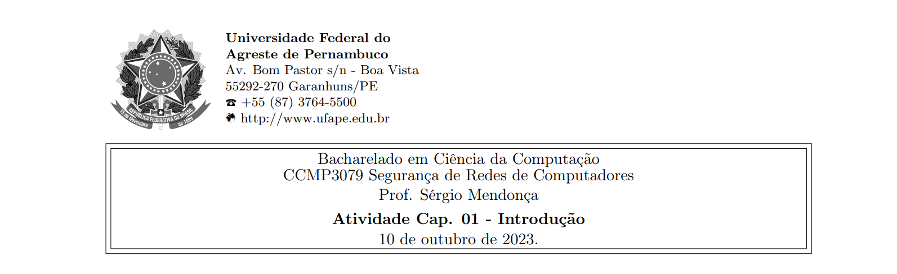



**Nome completo**: Thiago Cavalcanti Silva

Questões retiradas do livro-texto da disciplina.

## 1. O que é a arquitetura de segurança OSI?

Um padrão internacional, desenvolvido no contexto da arquitetura de protocolo OSI (Open System Interconnection), para sistematizar requisitos de segurança e técnicas a serem empregadas. Proporcionou o estabelecimento de recursos de segurança para produtos e serviços.

&nbsp;

## 2. Qual é a diferença entre ameaças à segurança passivas e ativas?

As passivas tentam descobrir ou usar informações do sistema, sem afetar seus recursos. Enquanto as ativas tentam alterar recursos do sistema ou afetar sua operação.

Por exemplo, um interceptador em uma troca de mensagens. No contexto passivo, estará apenas lendo a conversa. Já no ativo, modifica as informações entre origem e destino.

&nbsp;

## 3. Liste e defina resumidamente as categorias de ataques passivos e ativos à segurança.

Passivo:

- Vazamento de conteúdo de mensagem: quando um interceptador acessa a informação trocada entre remetente e destinatário.

- Análise de tráfego: um oponente não tem acesso ao conteúdo, porém observa a frequência de comunicação e tamanho das mensagens, além de ter meios para determinar local e identidade dos interlocutores.

Ativo:

- Disfarce: quando uma entidade finge ser outra. Geralmente inclui outras formas de ataque.

- Repasse: após capturar dados passivamente, ocorre a retransmissão.

- Modificação de mensagens: alteração do conteúdo de uma mensagem, reordenação ou adiamento.

- Negação de serviço: impedimento do uso normal, podendo ser direcionado a uma entidade ou uma rede inteira.

&nbsp;

## 4. Liste e defina resumidamente as categorias dos serviços de segurança.

- Autenticação: garantia de uma comunicação autêntica, ou seja, garantir ao destinatário que a mensagem tem a origem de que ela afirma ter vindo.

- Controle de acesso: limitar o acesso aos sistemas, ajustando os direitos de acesso às entidades identificadas/autenticadas.

- Confidencialidade dos dados: proteção dos dados transmitidos contra ataques passivos. Podendo proteger o fluxo de tráfego contra análise (explicada na questão anterior).

- Integridade dos dados: garante que mensagens sejam recebidas conforme enviadas, sem duplicação, inserção, modificação, destruição, reordenação ou repasses.

- Irretratabilidade: prova que entidades estavam envolvidas na comunicação, impedindo que elas neguem uma mensagem transmitida, alegando que o emissor de fato a transmitiu e o receptor recebeu.

&nbsp;

## 5. Liste e defina resumidamente as categorias dos mecanismos de segurança.

- Específicos: implementados em uma camada de protocolo específica para fornecer alguns dos serviços de segurança OSI. Exemplos são: codificação, assinatura digital, controle de acesso, integridade de dados e controle de roteamento.

- Difusos: não são específicos de camada de protocolo ou serviço de segurança. Como exemplos, tem-se: funcionalidade confiada, detecção de evento, trilha de auditoria de segurança e recuperação de segurança.

- Reversíveis: permite a reversão no processo, por exemplo, um mecanismo de codificação que permite que os dados sejam encriptados e depois decriptados.

- Irreversíveis: o contrário do anterior, ou seja, não permite a reversão no processo. Por exemplo, algoritmos de hash.

&nbsp;

## 6. Considere um caixa eletrônico, ATM no qual os usuários fornecem um cartão e um número de identificação pessoal (senha). Dê exemplos de requisitos de confidencialidade, integridade e disponibilidade associados com esse sistema e, em cada caso, indique o grau de importância desses requisitos.

- Confidencialidade: 

    - Preservar informações como saldo, dados sensíveis do usuário (número da conta, RG, CPF, etc.), dados do cartão e senha.

    - Alto: deve-se manter restrito o acesso às informações de acordo com a LGPD, principalmente as que possibilitam acesso à conta, o que poderia causar danos financeiros.

- Integridade: 

    - Não permitir alterações indevidas no saldo, através de saques para terceiros, débitos incorretos ou simplesmente a mudança de valor no sistema. Não permitir alterações no histórico de transações.

    - Alto: o sistema deve garantir que a movimentação financeira seja realizada corretamente, protegendo de ataques e de mudanças indevidas.

- Disponibilidade: 

    - Permitir o acesso rápido e confiável da conta do usuário.

    - Alto: no quesito velocidade, pode ser considerada moderada ou alta, visto que depende da necessidade do usuário de se ter o dinheiro naquele momento. No quesito confiabilidade, é considerado alto, pois os dados informados ao usuário devem ser fidedignos e o acesso a eles deve ser autenticado.

&nbsp;

## 7. Para responder as letras abaixo, por favor, consulte o livro-texto da disciplina:**

**(a) Desenhe uma matriz similar ao Quadro 1.4 que mostre o relacionamento entre serviços de segurança e ataques.**

Serviços = linhas; Ataques = colunas
||Vazamento de conteúdo de mensagem|Análise de tráfego|Disfarce|Repasse|Modificação de mensagens|
| :- | :-: | :-: | :-: | :-: | :-: |
|Autenticação de entidade paralela|S||S|S|S|
|Autenticação da origem de dados|S||S|S|S|
|Controle de acesso|S||S|S||
|Confidencialidade|S||S|S|S|
|Confidencialidade de fluxo de tráfego|S|S|S|S|S|
|Integridade de dados|||||S|
|Responsabilização|||S|||
|Disponibilidade||||||

&nbsp;

**(b) Desenhe uma matriz similar ao Quadro 1.4 que mostre o relacionamento entre mecanismos de segurança e ataques.**

Mecanismos = linhas; Ataques = colunas
||Vazamento de conteúdo de mensagem|Análise de tráfego|Disfarce|Repasse|Modificação de mensagens|
| :- | :-: | :-: | :-: | :-: | :-: |
|Codificação|S|S|S|S|S|
|Assinatura digital|S|S|S|S|S|
|Controle de acesso|S||S|S|S|
|Integridade de dados|||||S|
|Troca de autenticação|S|S|S|S||
|Preenchimento de tráfego||S||||
|Controle de roteamento|S|||S||
|Notarização|S||S|S|S|

&nbsp;

Livro-texto da disciplina:

STALLINGS, William. Criptografia e segurança de redes. Princípios e práticas, Ed. 6. 2014.
