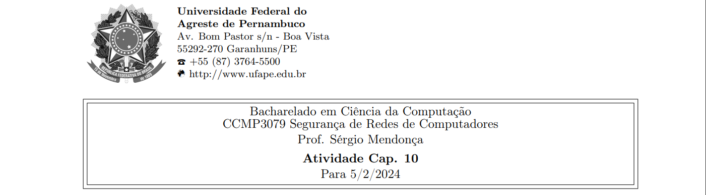



**Nome completo**: Thiago Cavalcanti Silva

Questões retiradas do livro-texto da disciplina. Conforme conversamos em sala de aula, as atividades devem ser realizadas para apresentação e discussão em sala, sempre nas aulas das quintas-feiras, atribuindo ao estudante uma nota de 0 ou 1 por cada atividade realizada e apresentada.

## 1. Os usuários A e B utilizam a técnica de troca de chaves Diffie-Hellman com um primo comum q = 71 e uma raiz primitiva α = 7.

**(a) Se o usuário A tem chave privada XA = 5, qual é a chave pública de A, YA?**

A chave pública é a raiz primitiva elevado a chave privada, calculando o módulo do primo, ou seja, αX mod q.

Logo, YA = 75 mod 71 = 16807 mod 71 = 51.

&nbsp;

**(b) Se o usuário B tem chave privada XB = 12, qual é a chave pública de B, YB?**

Seguindo o raciocínio da anterior, temos que: YB = 712 mod 71 = 13841287201 mod 71 = 4.

&nbsp;

**(c) Qual é a chave secreta compartilhada?** 

Para chegar no segredo, há duas formas: chave pública de um elevado a chave privada do outro módulo primo.

(YB)Xa mod q = 45 mod 71 = 1024 mod 71 = 30.

(YA)Xb mod q = 5112 mod 71 = 30.

&nbsp;

## 2. Considere um esquema Elgamal com um primo comum q = 71 e uma raiz primitiva α = 7.

**(a) Se B tem chave pública YB = 3 e A escolheu um inteiro aleatório k = 2, qual é o texto cifrado de M = 30?**

C1 = αk mod q = 72 mod 71 = 49

C2 = M \* YBXb mod q = 30 \* 32 mod 71 = 30 \* 9 mod 71 = 270 mod 71 = 57

Logo, o texto será (49, 57).

&nbsp;

**(b) Se A, então, selecionar um valor diferente de k, de modo que a codificação de M = 30 seja C = (59, C2), qual é o inteiro C2?**

Sabemos que C1 = 59 = αk mod q = 7k mod 71

Buscando os valores em que 7k mod 71 = 59, temos 7³ mod 71 = 59. Ou seja, k = 3.

Temos que C2 = M \* YBXb mod q = 30 \* 3³ mod 71 = 30 \* 9 mod 71 = 810 mod 71 = 29.

&nbsp;

## 3. Demonstre que as duas curvas elípticas da Figura 10.4 satisfazem, cada uma, às condições para um grupo sobre os números reais.

É necessário que a curva satisfaça a equação 10.1, que define o formato de uma curva elíptica:

y² = x³ + ax + b. Além disso, precisa atendar a equação 10.2, que afirma que a curva elíptica sobre números reais define um grupo se: 4a³ + 27b² ≠ 0.

Para a curva a, y² = x³ - x, temos que satisfaz a equação 10.1, onde a é -1 e b é 0. 

Verificando a equação 2, temos: 

4\*(-1)³ + 27\*(0)² ≠ 0

-4 ≠ 0

&nbsp;

Para a curva b, y² = x³ + x + 1, temos que satisfaz a equação 10.1, onde a é 1 e b é 1. 

Verificando a equação 2, temos: 

4\*(1)³ + 27\*(1)² ≠ 0

31 ≠ 0

&nbsp;

Logo, as duas equações atendem os requisitos para um grupo sobre os números reais.

&nbsp;

## 4. (4, 7) é um ponto na curva elíptica y² = x³ − 5x + 5 sobre números reais?

Sim, pois a equação permanece verdadeira para x = 4 e y = 7. Substituindo os valores na equação:

7² = 4³ - 5\*4 + 5

49 = 64 – 20 + 5

49 = 49

&nbsp;

**Livro-texto da disciplina:** STALLINGS, William. Criptografia e segurança de redes. Princípios e práticas, Ed. 6. 2014
