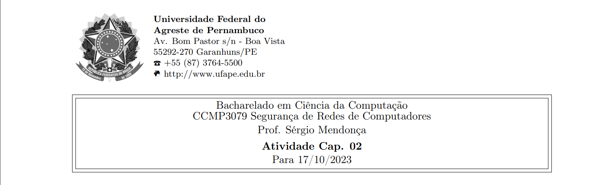
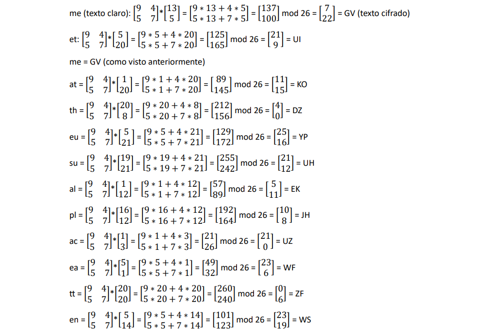
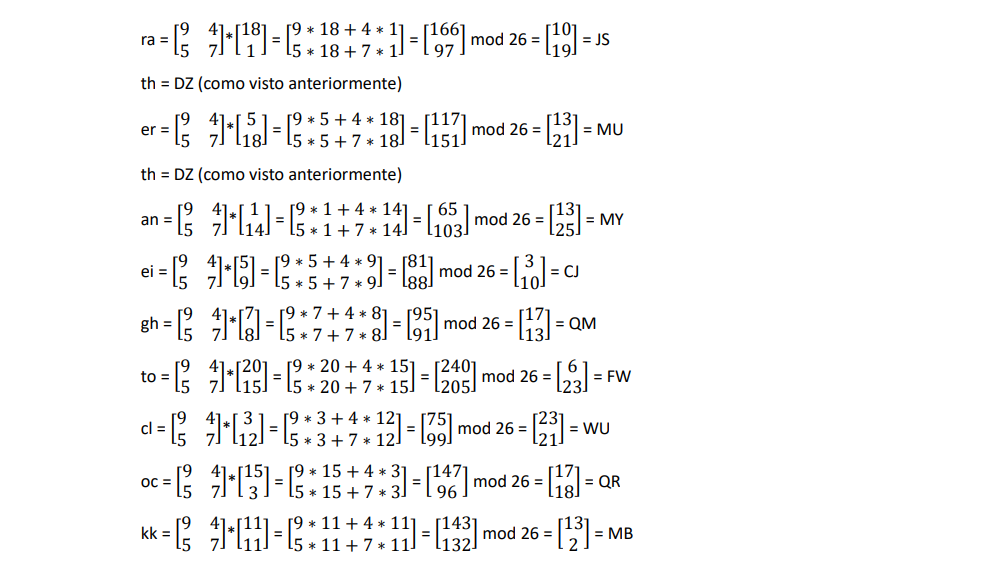
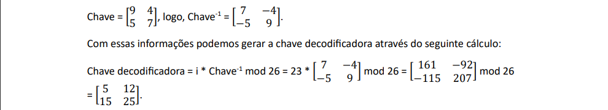



**Nome completo**: Thiago Cavalcanti Silva

Questões retiradas do livro-texto da disciplina.

## 1. Responda (de forma objetiva) as questões a seguir:

**(a) Quais são os elementos essenciais de uma cifra simétrica?** 

- Texto claro: mensagem original.
- Algoritmo de encriptação: realiza substituições e transformações no texto claro.
- Chave secreta: um valor independente do texto e do algoritmo, que também é entrada para o algoritmo e varia a saída do texto.
  Texto cifrado: mensagem embaralhada produzida pelo algoritmo.
- Algoritmo de decriptação: inverso da encriptação, recebe o texto cifrado e a chave e retorna o texto original.

**(b) Quais são as duas funções básicas usadas nos algoritmos de encriptação?** 

Substituição (mapeamento de cada elemento do texto claro em outro elemento) e transposição (rearranjo dos elementos do texto claro).

**(c) Qual é a diferença entre uma cifra de bloco e uma cifra de fluxo?** 

A de bloco processa a entrada de um bloco de elementos por vez, produzindo a saída para cada um deles. Já a cifra em fluxo, processa os elementos continuamente, retornando a saída de um elemento de cada vez.

**(d) Quais são as duas técnicas gerais para atacar uma cifra?** 

Criptoanálise (explora o algoritmo e talvez características ou amostras de pares de texto claro-texto cifrado) e ataque por força bruta (teste de todas as chaves possíveis).

**(e) Quais são os dois problemas com o one-time pad?**

Criar grandes quantidades de chaves aleatórias, já que para cada encriptação será usada uma chave diferente. E também a distribuição e proteção da chave, pois a cada mensagem uma chave de mesmo tamanho do texto é necessária para o emissor e receptor.

**(f) O que é uma cifra de transposição?** 

Algum tipo de permutação nas letras do texto claro.

**(g) O que é esteganografia?**

É uma técnica para esconder a existência da mensagem. Não é exatamente uma forma de encriptar, visto que a criptografia transforma o texto em vez de ocultá-lo.

&nbsp;

## 2. Uma generalização da cifra de César, conhecida como cifra de César afim, tem a seguinte forma: a cada letra de texto claro p, substitua-a pela letra de texto cifrado C:

**C = E([a, b], p) = (ap + b) mod 26**

**um requisito básico de qualquer algoritmo de encriptação é que ele seja um para um. Ou seja, se p ≠ q, então E(k, p) ≠ E(k, q). Caso contrário, a decriptação é impossível, pois mais de um caractere de texto claro é mapeado no mesmo caractere de texto cifrado. A cifra de César afim não é um-para-um para todos os valores de a. Por exemplo, para a = 2 e b = 3, então E([a, b], 0) = E([a, b], 13) = 3.** 

**(a) existem limitações sobre o valor de b? explique por que sim ou por que não.**

Não há limitações específicas sobre o valor de 'b' em termos de tornar a cifra um-para-um. O valor de 'b' é um deslocamento e não afeta a reversibilidade da cifra. Entretanto, o valor de 'a' deve ser escolhido de forma que o processo seja inversível (possua um inverso multiplicativo módulo 26).

**(b) determine quais valores de a não são permitidos.**

Para garantir que a cifra seja "um-para-um" (ou injetiva), é necessário que a função de criptografia seja reversível, ou seja, que seja possível reverter o processo para decifrar a mensagem. Portanto:

'a' e 26 devem ser primos entre si (coprimos): Isso significa que 'a' não pode ter nenhum fator em comum com 26, exceto 1. Se 'a' e 26 não forem coprimos, a cifra não será injetiva porque alguns caracteres do texto claro mapearão para os mesmos caracteres no texto cifrado, tornando a decodificação impossível.  

**(c) ofereça uma afirmação geral sobre quais valores de a são e não são permitidos. Justifique-a.**

'a' deve ser um número ímpar, pois, se 'a' for par, ele será divisível por 2, o que não seria coprimo com 26.

&nbsp;

**3. (a) Encripte a mensagem “meet me at the usual place at ten rather than eight oclock” usando a cifra de Hill com a chave . Mostre seus cálculos e o resultado.**

Como a matriz possui duas linhas, devemos dividir a mensagem em blocos de duas letras.

Blocos: me et me at th eu su al pl ac ea tt en ra th er th an ei gh to cl oc kk

Como o ‘k’ estava sozinho, repete-se e ao fim da cifragem, remove-o.

Estes valores serão convertidos para números, onde:

|A|B|C|D|E|F|G|H|I|J|K|L|M|N|O|P|Q|R|S|T|U|V|W|X|Y|Z|
| - | - | - | - | - | - | - | - | - | - | - | - | - | :- | :- | :- | :- | :- | :- | :- | :- | :- | :- | :- | :- | :- |
|1|2|3|4|5|6|7|8|9|10|11|12|13|14|15|16|17|18|19|20|21|22|23|24|25|0|

Dessa forma, (matriz chave \* matriz das letras convertidas em número) mod 26 nos dará o texto cifrado.




Portanto, a mensagem cifrada é: 

GVUIGVKODZYPUHEKJHUZWFZFWSJSDZMUDZMYCJQMFWWUQRMB

&nbsp;

**(b) Mostre os cálculos para a decriptação correspondente do texto cifrado a fim de recuperar o texto claro original.**

Para decriptar, precisamos do inverso multiplicativo modular do determinante (obtido pelo determinante da chave) e da matriz inversa da chave.

Determinante da chave = detChave = (7 \* 9) – (-4 \* -5) = 63 – 20 = 43

Inverso modular = (detChave \* i) mod 26 = 1

`                                 `(43 \* i) mod 26 = 1

i = 23, pois (43 \* 23) mod 26 = 989 mod 26 = 1



Agora, basta multiplicar a chave decodificadora pela representação numérica das letras, calculando o módulo de 26, para obter a mensagem original.

|A|B|C|D|E|F|G|H|I|J|K|L|M|N|O|P|Q|R|S|T|U|V|W|X|Y|Z|
| - | - | - | - | - | - | - | - | - | - | - | - | - | :- | :- | :- | :- | :- | :- | :- | :- | :- | :- | :- | :- | :- |
|1|2|3|4|5|6|7|8|9|10|11|12|13|14|15|16|17|18|19|20|21|22|23|24|25|0|


 
Agora basta remover o último k, pois foi duplicado já que a mensagem era de tamanho ímpar.

&nbsp;

# **4. Elabore um programa que possa encriptar e decriptar usando a cifra de César geral, também conhecida como cifra aditiva.**

Definindo variáveis e funções auxiliares:

```
alfabeto = "zabcdefghijklmnopqrstuvwxy"
```

```
def eh_caractere_alfabetico(caractere):
    return (caractere.lower() in alfabeto)
```

```
def caractere_para_numero(caractere):
    return alfabeto.index(caractere.lower())
```

```
def numero_para_caractere(numero):
    return alfabeto[numero % 26]
```

#### Encriptação com a cifra de César utilizando qualquer chave inteira

```
def encriptar_por_cesar(chave, texto_claro):
    texto_cifrado = ""
    for i in range(len(texto_claro)):
        caractere_original = texto_claro[i]
        if eh_caractere_alfabetico(caractere_original):
            caractere_deslocado = (chave + caractere_para_numero(caractere_original)) % 26
            caractere_cifrado = numero_para_caractere(caractere_deslocado)
        else:
            caractere_cifrado = caractere_original
        texto_cifrado += caractere_cifrado
    return texto_cifrado
```

#### Decriptação com a cifra de César utilizando qualquer chave inteira

```
def decriptar_por_cesar(chave, texto_cifrado):
    texto_claro = ""
    for i in range(len(texto_cifrado)):
        caractere_cifrado = texto_cifrado[i]
        if eh_caractere_alfabetico(caractere_cifrado):
            caractere_deslocado = (caractere_para_numero(caractere_cifrado) - chave) % 26
            caractere_original = numero_para_caractere(caractere_deslocado)
        else:
            caractere_original = caractere_cifrado
        texto_claro += caractere_original
    return texto_claro
```

#### Execução do algoritmo da cifra de César

```
chave = 10
```

```
texto_cifrado = encriptar_por_cesar(chave, f'Esse é o texto original e a chave é {chave}')
print(f'Texto cifrado: {texto_cifrado}')
```

    Texto cifrado: occo é y dohdy ybsqsxkv o k mrkfo é 10

```
texto_claro = decriptar_por_cesar(chave, texto_cifrado)
print(f'Texto claro: {texto_claro}')
```

    Texto claro: esse é o texto original e a chave é 10


&nbsp;

# **5. Elabore um programa que possa realizar um ataque de frequência de letra em uma cifra aditiva sem intervenção humana. Seu software deverá produzir textos claros possíveis em ordem aproximada de probabilidade. Seria bom se a sua interface com o usuário permitisse que ele especificasse “mostre os 10 textos claros mais prováveis”.**

Para determinar qual texto é mais provável, calcularemos a probabilidade de acordo com a frequência que as letras aparecem nas frases em português

```
frequencia_portugues = {
    'a': 14.63, 'b': 1.04, 'c': 3.88, 'd': 5.901, 'e': 12.57, 'f': 1.02,
    'g': 1.30, 'h': 1.28, 'i': 6.18, 'j': 0.40, 'k': 0.02, 'l': 2.78,
    'm': 4.74, 'n': 5.05, 'o': 10.73, 'p': 2.52, 'q': 1.20, 'r': 6.53,
    's': 7.81, 't': 4.34, 'u': 4.63, 'v': 1.67, 'w': 0.01, 'x': 0.21,
    'y': 0.01, 'z': 0.47
}

# Função para calcular a pontuação de um texto com base na frequência das letras
def calcular_pontuacao(texto):
    pontuacao = 0
    for caractere in texto:
        if caractere in alfabeto:
            pontuacao += frequencia_portugues[caractere]
    return pontuacao
```

```
import string

def retornar_textos_claros_com_probabilidade(texto_cifrado):
    textos_mais_provaveis = []
    
    for chave in range(26):
        texto_claro = decriptar_por_cesar(chave, texto_cifrado)
        pontuacao = calcular_pontuacao(texto_claro)
        textos_mais_provaveis.append((chave, texto_claro, pontuacao))
        
    return textos_mais_provaveis
```

```
def printar_textos_mais_provaveis(textos, quantidade_de_textos):
    textos_mais_provaveis.sort(key=lambda x: -x[2])
    
    for i, (chave, texto_claro, pontuacao) in enumerate(textos[:quantidade_de_textos]):
        print(f"({i + 1}) - Chave = {chave:02d} - Texto decifrado: {texto_claro}")
```

```
#numero_de_descricoes = int(input("Quantos textos mais prováveis você deseja visualizar? "))
numero_de_textos_provaveis = 3

#texto_cifrado = input("Digite o texto cifrado")
texto_cifrado = 'aekv cobá y dohdy mvkby?'

textos_mais_provaveis = retornar_textos_claros_com_probabilidade(texto_cifrado)
printar_textos_mais_provaveis(textos_mais_provaveis, numero_de_textos_provaveis)
```

    (1) - Chave = 10 - Texto decifrado: qual será o texto claro?
    (2) - Chave = 24 - Texto decifrado: cgmx eqdá a fqjfa oxmda?
    (3) - Chave = 21 - Texto decifrado: fjpa htgá d itmid rapgd?

&nbsp;

# **6. Crie um software que possa encriptar e decriptar usando uma cifra de Hill 2 × 2.**

Funções auxiliares para a matriz:

```
def ler_matriz_chave():
    while True:
        try:
            entrada = input("Informe os elementos da matriz 2x2 separados por espaços (exemplo: 1 2 3 4): ")
            elementos = list(map(int, entrada.split()))
            if len(elementos) == 4:
                return elementos
                break
            else:
                print("Você deve fornecer exatamente 4 números separados por espaços.")
        except ValueError:
            print("Por favor, insira números inteiros válidos.")
```

```
def criar_matriz_2x2(elementos):
    return matrix([ [elementos[0], elementos[1]], [elementos[2], elementos[3]] ])
```

```
def obter_determinante(matriz_chave):
    return matriz_chave.determinant()
```

```
def obter_inverso_multiplicativo_modular(determinante):
    return inverse_mod(determinante, 26)
```

```
def obter_matriz_inversa(matriz_chave):
    return matriz_chave^-1
```

```
def obter_matriz_decodificadora(matriz_chave):
    determinante = obter_determinante(matriz_chave)
    
    inverso_multiplicativo_modular = obter_inverso_multiplicativo_modular(determinante)
    
    matriz_inversa = obter_matriz_inversa(matriz_chave)
    matriz_inversa = matriz_inversa * matriz_chave.determinant()
    
    return (inverso_multiplicativo_modular * matriz_inversa) % 26
```

Funções auxiliares para a encriptação:

```
def quebrar_frase_em_blocos(texto_claro, tamanho_do_bloco):
    blocos = []
    for i in range(0, len(texto_claro), tamanho_do_bloco):
        blocos.append(texto_claro[i:i+tamanho_do_bloco].lower())
    return blocos
```

```
def converter_par_para_matriz_numerica(bloco):
    matriz = Matrix(2, 1, [caractere_para_numero(bloco[0]), caractere_para_numero(bloco[1])])
    return matriz
```

Funções para casos em que a string não pode ser dividida perfeitamente pelo tamanho do bloco

```
def adicionar_caractere_repetido(texto):
    texto += texto[-1]
    return texto
```

```
def remover_caractere_repetido(texto):
    return texto[:-1]
```

#### Encriptação com a cifra de Hill 2x2

```
def encriptar_por_hill(texto_claro, matriz_chave):
    if repete_a_ultima_letra:
        texto_claro = adicionar_caractere_repetido(texto_claro)
    
    blocos_do_texto_claro = quebrar_frase_em_blocos(texto_claro, 2)
    # print(f'Frase quebrada em blocos de 2 em 2 caracteres: {blocos_do_texto_claro}')
    
    texto_cifrado = ''
    
    for par in blocos_do_texto_claro:
        matriz_do_bloco = converter_par_para_matriz_numerica(par)
        resultado = matriz_chave * matriz_do_bloco
        resultado = resultado.apply_map(lambda x: x % 26)
        texto_cifrado += numero_para_caractere(resultado[0, 0]) + numero_para_caractere(resultado[1, 0])
    
    return texto_cifrado.upper()
```

#### Decriptação com a cifra de Hill 2x2

```
def decriptar_por_hill(texto_cifrado, matriz_chave):
    blocos_do_texto_cifrado = quebrar_frase_em_blocos(texto_cifrado, 2)
    # print(f'Frase quebrada em blocos de 2 em 2 caracteres: {blocos_do_texto_cifrado}')
    
    matriz_decodificadora = obter_matriz_decodificadora(matriz_chave)

    texto_decifrado = ''
    
    for par in blocos_do_texto_cifrado:
        matriz_do_bloco = converter_par_para_matriz_numerica(par)
        resultado = matriz_decodificadora * matriz_do_bloco
        resultado = resultado.apply_map(lambda x: x % 26)
        texto_decifrado += numero_para_caractere(resultado[0, 0]) + numero_para_caractere(resultado[1, 0])
        
    if repete_a_ultima_letra:
        texto_decifrado = remover_caractere_repetido(texto_decifrado)

    return texto_decifrado.lower()
```

Obtendo dados do terminal \(chave e frase\):

```
#elementos = ler_matriz_chave()
elementos = [9, 4, 5, 7]
matriz_chave = criar_matriz_2x2(elementos)
matriz_chave
```

    Informe os elementos da matriz 2x2 separados por espaços (exemplo: 1 2 3 4):  9 4 5 7

```
#texto_claro = input("Digite uma frase a ser cifrada com Hill 2x2: ")
texto_claro = 'meet me at the usual place at ten rather than eight oclock'

texto_claro_sem_espacos = texto_claro.replace(" ", "")
repete_a_ultima_letra = len(texto_claro_sem_espacos) % 2 == 1 # Se o tamanho da palavra for ímpar, repete a última para formar o bloco
```

```
texto_cifrado = encriptar_por_hill(texto_claro_sem_espacos, matriz_chave)
print(f'O texto cifrado por Hill é: {texto_cifrado}')

texto_decifrado = decriptar_por_hill(texto_cifrado, matriz_chave)
print(f'O texto decifrado por Hill é: {texto_decifrado}')
```

    O texto cifrado por Hill é: GVUIGVKODZYPUHEKJHUZWFZFWSJSDZMUDZMYCJQMFWWUQRMB
    O texto decifrado por Hill é: meetmeattheusualplaceattenratherthaneightoclock

&nbsp;

Livro-texto da disciplina:

STALLINGS, William. Criptografia e segurança de redes. Princípios e práticas, Ed. 6. 2014.