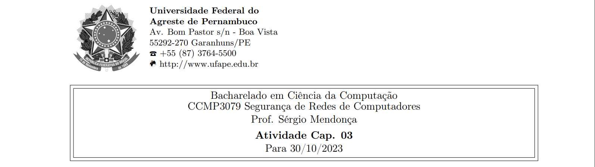

**Nome completo**: Thiago Cavalcanti Silva

Questões retiradas do livro-texto da disciplina.

# 1. Responda os questionamentos a seguir:

**(a) Por que é importante estudar a cifra de Feistel?** 

Ela oferece um modelo que foi usado como base para várias outras cifras simétricas, ou seja, além de sua importância histórica, auxilia no entendimento de alguns conceitos e etapas utilizados por outras cifras.

&nbsp;

**(b) Qual é a diferença entre uma cifra de bloco e uma cifra de fluxo?**

Cifra de fluxo é aquela que encripta um fluxo de dados digital um bit ou um byte por vez.

Já a de bloco, é aquela em que um bloco de texto claro é tratado como um todo e usado para produzir um de texto cifrado com o mesmo tamanho.


&nbsp;

**(c) Por que não é prático usar uma cifra de substituição reversível qualquer do tipo mostrado na Tabela 3.1?** 

Se ela for usada em um tamanho de bloco pequeno, como n = 4, então o sistema é equivalente a uma cifra de substituição clássica. Esses sistemas, como já vimos, são vulneráveis a uma análise estatística do texto claro.

Já para um grande tamanho de bloco, ela não é prática, de um ponto de vista de implementação e de desempenho.

&nbsp;

**(d) O que é uma cifra de produto?** 

A execução de duas ou mais cifras simples em sequência, de tal forma que o resultado ou produto final seja criptograficamente mais forte do que qualquer uma das cifras componentes.

&nbsp;

**(e) Qual é a diferença entre difusão e confusão?** 

A confusão é quando a estrutura estatística do texto claro é dissipada em estatísticas de longa duração do texto cifrado. Ou seja, ela busca tornar o relacionamento estatístico entre o texto claro e o texto cifrado o mais complexo possível, a fim de frustrar tentativas de deduzir a chave. Isso é obtido fazendo-se que cada dígito do texto claro afete o valor de muitos do texto cifrado.

Enquanto a difusão procura estabelecer o relacionamento entre as estatísticas do texto cifrado e o valor da chave de encriptação o mais complexo possível, novamente para frustrar tentativas de descobrir a chave. Assim, mesmo que o atacante possa ter alguma ideia das estatísticas do texto cifrado, o modo pelo qual a chave foi usada para produzir esse texto cifrado é tão complexo que torna difícil deduzir a chave.

&nbsp;

**(f) Que parâmetros e escolhas de projeto determinam o algoritmo real de uma cifra de Feistel?** 

Tamanho de bloco, tamanho da chave, número de rodadas, algoritmo de geração de subchave e função F.

&nbsp;

**(g) Explique o efeito avalanche.**

Quando uma pequena mudança no texto claro ou na chave produza uma alteração significativa no texto cifrado. Em particular, uma mudança em um bit do texto claro ou um bit da chave deverá produzir uma modificação em muitos bits do texto cifrado.

&nbsp;

## 2. Qual(is) dos recursos abaixo estão presentes no projeto da rede de Feistel? Explique.

(a) Tamanho do bloco e da chave; 

(b) Função da rodada; 

(c) Gerador de sub-chaves; 

(d) Todas as alternativas.

Letra D. Todos os recursos acima fazem parte da cifra de Feistel e influenciam na segurança do algoritmo.


&nbsp;

## 3. Qual é o tamanho do texto claro no Data Encryption Standard (DES)? Explique.

(a) 57; 

(b) 48; 

(c) 32; 

(d) 64.

Letra D. O DEA (Data encryption Algorithm), algoritmo utilizado pelo DES, encripta os dados em blocos de 64 bits.


&nbsp;

## 4. A cifra de Feistel do algoritmo de encriptação utilizada no Data Encryption Standard (DES) utiliza quantos S-boxes? Explique.

(a) 8;

(b) 7;

(c) 6; 

(d) 5.

Letra A. O DES possui oito tabelas de substituição, chamadas de S-boxes, utilizadas a cada iteração.

&nbsp;

## 5. O Data Encryption Standard possui uma chave de 56 bits, o que torna possível um espaço de 2<sup>56</sup> chaves possíveis. Essa sentença trata de ataque de. . . Explique.

(a) Tempo; 

(b) Matemático; 

(c) Força-Bruta;

(d) DoS.

Letra C. O ataque por força-bruta envolve tentar todas as combinações possíveis de chaves até encontrar a chave correta que descriptografa os dados com sucesso. Um ataque de força-bruta envolveria testar cada uma dessas chaves, o que seria demorado, mas possível.

&nbsp;

## 6. Demonstre, através de um exemplo, como realizar a cifragem de 16 bits (dois caracteres), em 2 rounds, em seguida, decifre o texto cifrado. Explique o processo passo a passo. Forneça um código Python/Sagemath com sua solução.

**Demonstração:**
Considerando uma encriptação simples, que aplica apenas um XOR no texto. A chave 1 será %, a chave 2 será U e a palavra será OK. 

Temos que:

O = 79 = 01001111

K = 75 = 01001011

Chave 1 = % = 37 = 00100101

Chave 2 = U = 85 = 01010101

&nbsp;

|Primeira rodada da encriptação:||
| :- | :-: |
|O = 01001111 | K = 01001011|
|Chave 1 = 00100101 | Chave 1 = 00100101|
|XOR = 01101010 = 106 = j | XOR = 01101110 = 110 = n|


|Segunda rodada da encriptação:||
| :- | :-: |
|j = 01101010 | n = 01101110|
|Chave 2 = 01010101 | Chave 2 = 01010101|
|XOR = 00111111 = 63 = ? | XOR = 00111011 = 59 = ;|

&nbsp;

Para decriptar, basta fazer o processo inverso.

|Primeira rodada da decriptação:||
| :- | :-: |
|? = 00111111 | ; = 00111011|
|Chave 2 = 01010101 | Chave 2 = 01010101|
|XOR = 01101010 = 106 = j | XOR = 01101110 = 110 = n|


|Segunda rodada da decriptação:||
| :- | :-: |
|j = 01101010 | n = 01101110|
|Chave 1 = 00100101 | Chave 1 = 00100101|
|XOR = 01001111 = 79 = O | XOR = 01001011 = 75 = K|

&nbsp;

**A parte prática segue abaixo:**

Considerando uma encriptação simples, que aplica apenas um XOR no texto. A chave 1 será %, a chave 2 será U e a palavra será OK. 

```
texto_claro = "OK"
chave1 = "%"
chave2 = "U"
```

```
def caractere_para_binario(caractere):
    binario = bin(ord(caractere))[2:]
    return '0' * (8 - len(binario)) + binario
```

```
def binario_para_caractere(binario):
    decimal = int(binario, 2)
    return chr(decimal)
```

```
def encriptar(texto, chave1, chave2):
    texto_binario = [caractere_para_binario(caractere) for caractere in texto]
    chave1_binaria = caractere_para_binario(chave1)
    chave2_binaria = caractere_para_binario(chave2)
    
    texto_encriptado = ''
    for caractere in texto_binario:
        xor_chave1 = ''.join(['1' if caractere[i] != chave1_binaria[i] else '0' for i in range(8)])
        xor_chave2 = ''.join(['1' if xor_chave1[i] != chave2_binaria[i] else '0' for i in range(8)])
        texto_encriptado += binario_para_caractere(xor_chave2)
    
    return texto_encriptado
```

```
def decriptar(texto_cifrado, chave1, chave2):
    chave1_binaria = caractere_para_binario(chave1)
    chave2_binaria = caractere_para_binario(chave2)
    
    texto_decifrado = ''
    for caractere in texto_cifrado:
        caractere_binario = caractere_para_binario(caractere)
        xor_chave2 = ''.join(['1' if caractere_binario[i] != chave2_binaria[i] else '0' for i in range(8)])
        xor_chave1 = ''.join(['1' if xor_chave2[i] != chave1_binaria[i] else '0' for i in range(8)])
        texto_decifrado += binario_para_caractere(xor_chave1)
    
    return texto_decifrado
```

```
texto_criptografado = encriptar(texto_claro, chave1, chave2)
print("Texto criptografado:", texto_criptografado)

texto_descriptografado = decriptar(texto_criptografado, chave1, chave2)
print("Texto descriptografado:", texto_descriptografado)
```

    Texto criptografado: ?;
    Texto descriptografado: OK

&nbsp;

## 7. Considere uma cifra de Feistel composta de 16 rodadas com tamanho de bloco de 128 bits e tamanho de chave de 128 bits. Suponha que, para determinado k, o algoritmo de escalonamento de chave defina valores as oito primeiras chaves de rodada, k<sub>1</sub>, k<sub>2</sub>, . . . , k<sub>8</sub>, e depois estabeleça 

<b>k<sub>9</sub> = k<sub>8</sub>, k<sub>10</sub> = k<sub>7</sub>, k<sub>11</sub> = k<sub>6</sub>, . . . , k<sub>16</sub> = k<sub>1</sub></b>

**Admita que você tenha um texto cifrado S. Explique como, com acesso a um oráculo de encriptação, você pode decriptar c e determinar m usando apenas uma única consulta a ele. Isso mostra que tal cifra é vulnerável a um ataque de texto claro escolhido. (Um oráculo de encriptação pode ser imaginado como um dispositivo que, dado um texto claro, retorna o texto cifrado correspondente. Os detalhes internos do dispositivo não são conhecidos, e você não pode abri-lo. Você só consegue obter informações do oráculo fazendo consultas a ele e observando suas respostas.)**

Temos que explorar a vulnerabilidade consequente da derivação de subchaves, visto que elas são espelhadas, tornando a decriptação o inverso da encriptação. Nesse caso, ao passar S para o oráculo, será devolvido S’ que é o texto cifrado de S (que já é cifrado).

Portanto, basta pedir ao oráculo que criptografe m’, que é o c, ou seja, cifrar o texto cifrado. Dessa forma, o oráculo retornará m, ou seja, a descriptografia de c. 

&nbsp;

**Livro-texto da disciplina:** STALLINGS, William. Criptografia e segurança de redes. Princípios e práticas, Ed. 6. 2014
