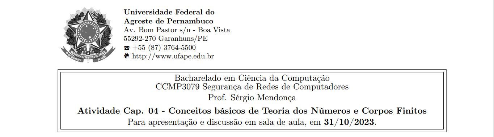
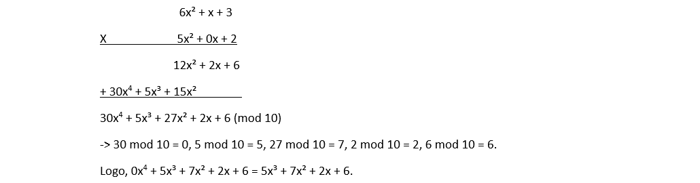



**Nome completo**: Thiago Cavalcanti Silva

Questões retiradas do livro-texto da disciplina. Conforme conversamos em sala de aula, as atividades devem ser realizadas para apresentação e discussão em sala, sempre nas aulas das quintas-feiras, atribuindo ao estudante uma nota de 0 ou 1 por cada atividade realizada e apresentada.

## 1. Defina resumidamente, um grupo, um anel, um corpo.

Grupo é um conjunto de elementos com uma operação binária (•) seja adição, multiplicação ou alguma operação matemática, que associa a cada par ordenado (a, b) de elementos em G um elemento (a • b) em G, obedecendo 4 axiomas: fechamento, associativo, elemento identidade e elemento inverso.

Caso satisfaça o axioma da comutatividade, é chamado de grupo abeliano.

Um anel R, às vezes indicado por {R, +, ×}, é um conjunto de elementos com duas operações binárias, chamadas adição e multiplicação, de forma que, para todo a, b, c em R, deverá obedecer aos axiomas anteriores (ou seja, ser um grupo abeliano), além do fechamento sob multiplicação, associatividade da multiplicação e leis distributivas.

Basicamente, um anel é um conjunto em que podemos realizar adição, subtração [a – b = a + (–b)] e multiplicação sem sair dele.

O anel pode possuir o axioma da comutatividade da multiplicação, identidade multiplicativa e sem divisores de zero, neste caso, torna-se um domínio integral.

Um corpo F, às vezes indicado por {F, +, ×}, é um conjunto de elementos com duas operações binárias, chamadas de adição e multiplicação, de modo que, para todo a, b, c em F, obedece aos axiomas anteriores, ou seja, é um domínio integral, além de possuir o inverso multiplicativo.

Basicamente, um corpo é um conjunto em que podemos realizar adição, subtração, multiplicação e divisão sem sair dele. A divisão é definida com a seguinte regra: a/b = a(b<sup>–1</sup>).

&nbsp;

## 2. O que significa dizer que b é um divisor de a?

Quando a = mb, para algum m, onde a, b e m são inteiros. Ou seja, b divide a se não houver resto na divisão.

&nbsp;

## 3. Para cada uma das seguintes equações, encontre um inteiro x que satisfaça:

**(a) 5x ≡ 4 (mod 3)** 

Devemos encontrar a classe inversa do 5 mod 3, ou seja, o número que multiplicado por 5 dividido por 3, deixe resto 1. Começaremos testando com o 1, em diante:

5\*1 = 5 ≡ 2 mod 3

5\*2 = 10 ≡ 1 mod 3 à Achamos o 2, logo, multiplicaremos ambos os lados da equação por ele.

2 \* 5x ≡ 2 \* 4 (mod 3)

10x = 8 (mod 3)

Podemos simplificar, visto que 10 ≡ 1 mod 3 e 8 ≡ 2 mod 3. Portanto:

1\*x = 2 mod 3

x = 2, podendo ser generalizado para x = 3k + 2

&nbsp;

**(b) 7x ≡ 6 (mod 5)** 

Devemos encontrar a classe inversa do 7 mod 5, ou seja, o número que multiplicado por 7 dividido por 5, deixe resto 1. Começaremos testando com o 1, em diante:

7\*1 = 7 ≡ 2 mod 5

7\*2 = 14 ≡ 4 mod 5 

7\*3 = 21 ≡ 1 mod 5 à Achamos o 3, logo, multiplicaremos ambos os lados da equação por ele.

3 \* 7x ≡ 3 \* 6 (mod 5)

21x = 18 (mod 5)

Podemos simplificar, visto que 21 ≡ 1 mod 5 e 18 ≡ 3 mod 5. Portanto:

1x = 3 mod 5

x = 3, podendo ser generalizado para x = 5k + 3

&nbsp;

**(c) 9x ≡ 8 (mod 7)**

Devemos encontrar a classe inversa do 9 mod 7, ou seja, o número que multiplicado por 9 dividido por 7, deixe resto 1. Começaremos testando com o 1, em diante:

9\*1 = 9 ≡ 2 mod 7

9\*2 = 18 ≡ 4 mod 7 

9\*3 = 27 ≡ 6 mod 7

9\*4 = 36 = 1 mod 7 à Achamos o 4, logo, multiplicaremos ambos os lados da equação por ele.

4 \* 9x ≡ 4 \* 8 (mod 7)

36x = 18 (mod 7)

Podemos simplificar, visto que 36 ≡ 1 mod 7 e 18 ≡ 4 mod 7. Portanto:

1x = 4 mod 7

x = 4, podendo ser generalizado para x = 7k + 4

&nbsp;

## 4. Encontre o inverso multiplicativo de cada elemento diferente de zero em Z<sub>5</sub>. 

O inverso multiplicativo de um elemento em um conjunto Zn (conhecido como anel de números inteiros módulo n) é um elemento que, quando multiplicado pelo elemento original, resulta em 1.

0: não existe

1: 1 \* x ≡ 1 (mod 5) à x = 1, pois 1 mod 5 = 1.

2: 2 \* x ≡ 1 (mod 5) à x = 3, pois 6 mod 5 = 1.

3: 3 \* x ≡ 1 (mod 5) à x = 2, pois 6 mod 5 = 1.

4: 4 \* x ≡ 1 (mod 5) à x = 4, pois 16 mod 5 = 1.

&nbsp;

# 5. Determine os MDC:

**(a) mdc(24140, 16762):**

24140 = 1 \* 16762 + 7378

16762 = 2 \* 7378 + 2006

7378 = 3 \* 2006 + 1360

2006 = 1 \* 1360 + 646

1360 = 2 \* 646 + 68

646 = 9 \* 68 + 34

68 = 2 \* 34 + 0

Portanto, o mdc é 34.

&nbsp;

**(b) mdc(4655, 12075).**

|4655|12075|3|
| :-: | :-: | :-: |
|4655|4025|5 (divide ambos)|
|931|805|5|
|931|161|7 (divide ambos)|
|133|23|7|
|19|23|19|
|1|23|23|
|1|1||

Como temos 5 e 7 como fator em comum, logo o mdc é 5 \* 7 = 35.

&nbsp;

## 6. Usando o algoritmo de Euclides estendido, encontre o inverso multiplicativo de:

**(a) 1234 mod 4321;** 

|Q|A1|A2|A3|B1|B2|B3|
| :-: | :-: | :-: | :-: | :-: | :-: | :-: |
|-|1|0|4321|0|1|1234|
|3|0|1|1234|1|-3|619|
|1|1|-3|619|-1|4|615|
|1|-1|4|615|2|-7|4|
|153|2|-7|4|-307|1075|3|
|1|-307|1075|3|309|**-1082**|1|

O inverso multiplicativo é -1082.

&nbsp;

**(b) 24140 mod 40902;** 

|Q|A1|A2|A3|B1|B2|B3|
| :-: | :-: | :-: | :-: | :-: | :-: | :-: |
|-|1|0|40902|0|1|24140|
|1|0|1|24140|1|-1|16762|
|1|1|-1|16762|-1|2|7378|
|2|-1|2|7378|3|-5|2006|
|3|3|-5|2006|-10|17|1360|
|1|-10|17|1360|13|-22|646|
|2|13|-22|646|-36|61|68|
|9|-36|61|68|337|-571|34|
|2|337|-571|34|-710|1203|0|

Não existe, pois não são relativamente primos.

&nbsp;

**(c) 550 mod 1769.**

|q|r|x|y|A|b|X2|X1|Y2|Y1|
| :-: | :-: | :-: | :-: | :-: | :-: | :-: | :-: | :-: | :-: |
|||||550|1769|1|0|0|1|
|0|550|1|0|1769|550|0|1|1|0|
|3|119|-3|1|550|119|1|-3|0|1|
|4|74|13|-4|119|74|-3|13|1|-4|
|1|45|-16|5|74|45|13|-16|-4|5|
|1|29|29|-9|45|29|-16|29|5|-9|
|1|16|-45|-14|29|16|29|-45|-9|14|
|1|13|74|-23|16|13|-45|74|14|-23|
|1|3|-119|37|13|3|74|-119|-23|37|
|4|1|**550**|-171|3|1|-119|550|37|-171|
|3|0|-1769|550|1|0|550|-1769|-171|550|

O inverso multiplicativo é 550.

&nbsp;

## 7. Determine o inverso multiplicativo de x<sup>3</sup> + x + 1 em GF(2<sup>4</sup>), com m(x) = x <sup>4</sup> + x + 1.

|Q|A1|A2|A3|B1|B2|B3|
| :-: | :-: | :-: | :-: | :-: | :-: | :-: |
|-|1|0|x <sup>4</sup> + x + 1|0|1|x <sup>3</sup> + x + 1|
|x|0|1|x <sup>3</sup> + x + 1|1|X|x² + 1|
|x|1|x|x <sup>2</sup> + 1|x|**x² + 1**|1|

O inverso multiplicativo é x² + 1.

&nbsp;

## 8. Para a aritmética de polinômios com coeficientes em Z<sub>10</sub>, realize os seguintes cálculos:

<b>(a) (7x + 2) − (x<sup>2</sup> + 5)</b>

0x² + 7x + 2

<u>- x² - 0x - 5</u>

-x² + 7x -3 (mod 10)

&nbsp;

<b>(b) (6x<sup>2</sup> + x + 3) × (5x<sup>2</sup> + 2)</b>



&nbsp;

## 9. Estruture uma calculadora simples de quatro funções em GF(2<sup>4</sup>). Você pode usar uma tabela com valores pré-calculados para os inversos multiplicativos.


```
ordem_do_corpo = 2^4
```

Definindo a tabela de inversos multiplicativos:

```
inversos_multiplicativos = {
    0: None, 1: 1, 2: None, 3: 11,
    4: None, 5: 13, 6: None, 7: 7,
    8: None, 9: 9, 10: None, 11: 3,
    12:None, 13: 5, 14: None, 15: 15
}
```

Definindo funções de operações:

```
def mod(numero, modulo):
    return numero % modulo
```

```
def somar(a, b):
    return mod(a + b, ordem_do_corpo)
```

```
def subtrair(a, b):
    return mod(a - b, ordem_do_corpo)
```

```
def multiplicar(a, b):
    return mod(a * b, ordem_do_corpo)
```

```
def dividir(a, b):
    if b == 0:
        return None  # Divisão por zero não é possível
    else:
        inverso_b = inversos_multiplicativos[b]
        if inverso_b is None:
            return None  # Não é possível encontrar o inverso
        return mod(a * inverso_b, ordem_do_corpo)
```

```
a = 9
b = 3
```

```
print(f'A soma de {a} e {b} em GF({ordem_do_corpo}) é {somar(a, b)}')
print(f'A subtração de {a} por {b} em GF({ordem_do_corpo}) é {subtrair(a, b)}')
print(f'A multiplicação de {a} e {b} em GF({ordem_do_corpo}) é {multiplicar(a, b)}')
print(f'A divisão de {a} por {b} em GF({ordem_do_corpo}) é {dividir(a, b)}')
```

    A soma de 9 e 3 em GF(16) é 12
    A subtração de 9 por 3 em GF(16) é 6
    A multiplicação de 9 e 3 em GF(16) é 11
    A divisão de 9 por 3 em GF(16) é 3

### Também poderíamos otimizar, usando as funções disponíveis no SageMath.

Para criar o corpo finito, com ou sem ordem de uma potência prima. E também, utilizar as funções de operações que já são definidas como:

Adição: a \+ b

Subtração: a \- b

Multiplicação: a \* b

Divisão: a / b

Inverso multiplicativo: 1/a ou a^\-1


&nbsp;

**Livro-texto da disciplina:** STALLINGS, William. Criptografia e segurança de redes. Princípios e práticas, Ed. 6. 2014
