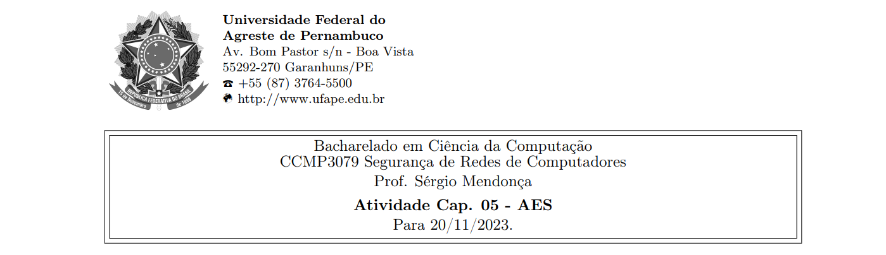
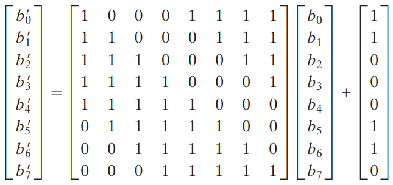



**Nome completo**: Thiago Cavalcanti Silva

Questões retiradas do livro-texto da disciplina. Conforme conversamos em sala de aula, as atividades devem ser realizadas para apresentação e discussão em sala, sempre nas aulas das quintas-feiras, atribuindo ao estudante uma nota de 0 ou 1 por cada atividade realizada e apresentada.

## 1. Qual foi o conjunto original de critérios usados pelo NIST para avaliar as cifras AES candidatas?

Deveria ser uma cifra simétrica que fosse capaz de trabalhar com blocos de 128 bits e chaves de 128, 196 e 256 bits. Sendo tão segura quanto o triplo DES, porém, mais eficiente.

As cifras foram avaliadas por características de implementação e algoritmo, segurança, custo e resistência contra ataques conhecidos.

&nbsp;

## 2. Qual foi o conjunto final de critérios usados pelo NIST para avaliar as cifras AES candidatas?

Segurança, custo de implementação, performance/desempenho (tanto em hardware quanto em software), tempo de expansão de chave, memória

&nbsp;

## 3. Qual é a diferença entre Rijndael e AES?

O Rijndael pode ser implementado para diferentes comprimentos de bloco de texto claro e de chave, como 128, 160, 190, 222 e 256 bits. Já o AES, trabalha com 128 bits de comprimento de bloco e a chave pode ser de 128, 196 ou 256 bits. Em resumo, o AES é uma implementação específica do Rijndael (um subconjunto do Rijndael).

&nbsp;

## 4. Responda:

**(a) Qual é a finalidade do array Estado?**

O valor inicial da matriz Estado é o texto claro (uma matriz quadrada de bytes), que é modificado por cada função subsequente no processo de encriptação, produzindo após a última o texto cifrado. Ou seja, serve como uma estrutura de dados intermediária usada nos processos de criptografia e descriptografia, armazenando o resultado das transformações das 4 operações principais a cada rodada. 

&nbsp;

**(b) Como é construída a S-box?**

1\. Inicialize a S-box com os valores em byte em sequência crescente linha por linha. A primeira linha contém {00}, {01}, {02}, ..., {0F}; a segunda linha contém {10}, {11} etc.; e assim por diante. Desse modo, o valor do byte na linha y, coluna x é {yx}.

2\. Mapeie cada byte na S-box com seu inverso multiplicativo no corpo finito GF(28); o valor {00} é mapeado consigo mesmo. Pois o zero não possui inverso multiplicativo.

3\. Considere que cada byte na S-box consiste em 8 bits rotulados (b7, b6, b5, b4, b3, b2, b1, b0). Aplique a seguinte transformação a cada bit de cada byte na S-box:

bi’ = bi ⊕ b(i + 4) mod 8 ⊕ b(i + 5) mod 8 ⊕ b(i + 6) mod 8 ⊕  b(i + 7) mod 8 ⊕  ci 

onde ci é o i-ésimo bit do byte c com o valor {63}; ou seja, (c7c6c5c4c3c2c1c0) = (01100011). Aspas simples indicam que a variável deve ser atualizada pelo valor à direita. O padrão AES representa essa transformação em forma matricial da seguinte maneira:

Na multiplicação de matriz comum, cada elemento na matriz produto é a soma dos produtos dos elementos de uma linha e uma coluna. Nesse caso, cada elemento na matriz produto é o XOR bit a bit de produtos de elementos de uma linha e uma coluna.

&nbsp;

**(c) Descreva rapidamente o estágio SubBytes, ShiftRows, MixColumns, AddRoundKey, e o algoritmo de expansão de chave.**

- SubBytes: utiliza uma S-box para realizar uma substituição byte a byte do bloco.
- ShiftRows: uma permutação simples através do deslocamento de linhas.
- MixColumns: uma substituição que utiliza aritmética sobre GF(28), embaralhando colunas individualmente.
- AddRoundKey: um XOR bit a bit simples do bloco atual com uma parte da chave expandida.
- Algoritmo de expansão de chave: utiliza como entrada uma chave de 4 words (16 bytes) e produz um array linear de 44 words (176 bytes). Isso é suficiente para oferecer uma chave da rodada de 4 words para o estágio AddRoundKey inicial e para cada uma das 10 rodadas da cifra.

&nbsp;

## 5. Quantos bytes em Estado são afetados por ShiftRows?

Essa transformação desloca à esquerda, de maneira incremental e circular, cada linha com exceção da primeira. Ou seja, a primeira linha permanece inalterada, a segunda tem um byte deslocado, a terceira tem dois bytes deslocados e a última tem três bytes deslocados.

Ou seja, 6 bytes deslocados, que acabam afetando completamente três linhas da matriz, resultando em 12 bytes modificados.

&nbsp;

## 6. Use a chave 1010 0111 0011 1011 para encriptar o texto claro "ok" conforme expresso em ASCII, ou seja, 0110 1111 0110 1011. Os projetistas do S-AES obtiveram o texto cifrado 0000 0111 0011 1000. E você?

Começamos pela expansão de chave através do algoritmo:

Dessa forma, temos as seguintes chaves:

w0 = 1010 0111 

w1 = 0011 1011 

w2 = 0001 1100 

w3 = 0010 0111

w4 = 0111 0110 

w5 = 0101 0001

Agora podemos começar as rodadas do algoritmo de encriptação.

Rodada 0:
Inclusão de chave: realizamos um XOR bit a bit entre a chave inicial e o texto expresso em bytes, que nos resulta 1100 1000 0101 0000.

&nbsp;

Rodada 1: 

Substituição de nibble: a pesquisa na tabela da S-box, resulta em 1100 0110 0001 1001.

Deslocamento de linha: realiza um deslocamento circular de um nibble da segunda linha da matriz de Estado, mas a primeira linha não é alterada. Resultado: 1100 1001 0001 0110

Embaralhamento de colunas: opera sobre cada coluna individualmente, mapeando cada nibble para um novo valor através da multiplicação sobre a matriz de estado. Nesse caso, retornou 1110 1100 1010 0010.

Após a inclusão de chave de rodada: 1110 1100 1010 0010.

&nbsp;

Rodada 2:

Substituição de nibble: 1111 0000 1000 0101

Deslocamento de linha: 0111 0001 0110 1001

Após incluir a chave da rodada (XOR com w4 e w5): 0000 0111 0011 1000, que é o texto cifrado. 

&nbsp;

## 7. Compare AES com DES. Para cada um dos seguintes elementos do DES, indique o elemento comparável no AES ou explique por que ele não é necessário no AES.

**(a) XOR do material da subchave com a entrada da função f.**

A transformação respectiva no AES é a AddRoundKey (transformação direta de adição de chave da rodada), onde os bits de estado passam por um XOR bit a bit com os bits da chave da rodada.

&nbsp;

**(b) XOR da saída da função f com a metade esquerda do bloco.**

Analisando a interação dos bits uns com os outros, essa etapa se assemelha ao MixColumn, onde há o embaralhamento das colunas.

&nbsp;

**(c) função f.**

A SubByte, pois utiliza a tabela S-box para substituir bytes, de forma que o mapeamento para uma saída qualquer a cada entrada quebra a linearidade da resposta.

&nbsp;

**(d) permutação P.**

Seria a etapa ShiftRow, pois realiza um deslocamento à esquerda, permutando os bytes.

&nbsp;

**(e) troca de metades do bloco.**

Não há uma troca de linhas ou colunas entre uma etapa e outra, como no DES. Como o MixColumn já realiza o embaralhamento de todos os outros bytes da coluna, não há necessidade de trocar linhas. Já a ShiftRow, move bytes de uma coluna para outra a cada linha (com exceção da primeira), dessa forma, não há necessidade de trocar colunas.

&nbsp;

## 8. (1 ponto-extra) Calcule a saída da transformação MixColumns para a seguinte sequência de bytes de entrada "67 89 AB CD". Aplique a transformação InvMixColumns ao resultado obtido para verificar seus cálculos. Altere o primeiro byte da entrada de "67"para "77", realize a transformação MixColumns novamente para a nova entrada e determine quantos bits mudaram na saída.

**Nota: você pode realizar todos os cálculos à mão ou escrever um programa que dê suporte a eles. Se escolher escrever um programa, ele deverá ser feito inteiramente por você; nesta tarefa, não use bibliotecas ou código fonte de domínio público (você pode se guiar pelos exemplos Sage disponibilizados).**

Primeiro, convertemos os bytes de entrada em uma matriz para ser usada como entrada:

A transformação direta de embaralhamento de colunas acontece pela multiplicação com a matriz fixa. Porém, em GF(28), as somas serão XOR bit a bit e a multiplicação será um deslocamento à esquerda seguido por um XOR bit a bit. 

Para verificar o resultado com a inversa, basta fazer o mesmo processo, utilizando a seguinte matriz fixa:

Isso confirma que o cálculo anterior está correto.

&nbsp;

Agora, mudaremos um byte da entrada para 77, alterando um bit (de 110 para 111). Dessa forma, a matriz fica:

Aplicando a transformação mix columns, temos:

Comparando com a saída anterior, conseguimos determinar quantos bits mudaram.

No primeiro byte tínhamos 28 e virou 08, logo, a primeira parte mudou. Dois em binário é 10, enquanto o zero é 0. Ou seja, adicionamos o dígito ‘1’ na frente do ‘0’. Isto é, houve mudança de um bit.

No segundo, tínhamos 45 e virou 55. Quatro em binário é 100, para virar 5, mudamos o último dígito, ficando 101. Logo, mais um bit que mudou.

No terceiro byte, a primeira saída foi EF e a segunda FF. E em binário é 1110 e F é 1111. Ou seja, o último bit mudou.

E no último, tínhamos 0A que se transformou em 3A. Zero é 0 em binário e três é 100. Portanto, acrescentamos dois bits.

Em resumo, temos que a quantidade de bits mudados foi 5 (1 + 1 + 1 + 2). 

&nbsp;

## 9. (2 pontos-extra) Crie um software que possa encriptar e decriptar usando S-AES. Dados de teste: um texto claro binário de 0110 1111 0110 1011 encriptado com uma chave binária de 1010 0111 0011 1011 deverá dar o texto cifrado binário 0000 0111 0011 1000. A decriptação deverá funcionar da mesma forma.

&nbsp;

**Livro-texto da disciplina:** STALLINGS, William. Criptografia e segurança de redes. Princípios e práticas, Ed. 6. 2014
