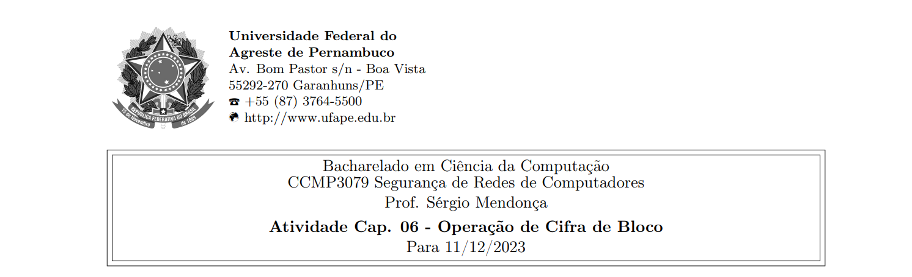
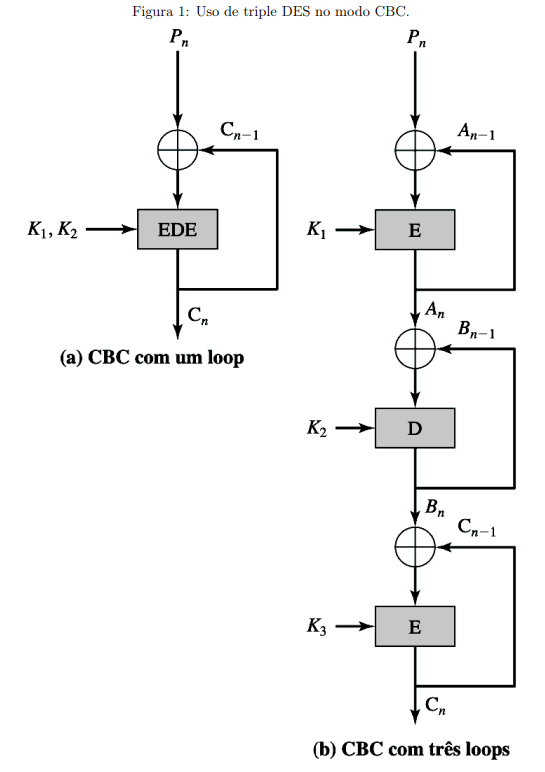



**Nome completo**: Thiago Cavalcanti Silva

Questões retiradas do livro-texto da disciplina. Conforme conversamos em sala de aula, as atividades devem ser realizadas para apresentação e discussão em sala, sempre nas aulas das quintas-feiras, atribuindo ao estudante uma nota de 0 ou 1 por cada atividade realizada e apresentada.

# 1. O que é encriptação tripla?

É realizar a encriptação três vezes. O texto claro é passado por um algoritmo de encriptação, o resultado é passado novamente pelo algoritmo e esta saída é criptografada pela terceira vez. Em alguns casos, a segunda etapa usa a decriptação em vez da encriptação.

&nbsp;

# 2. O que é ataque meet-in-the-middle?

Quando um analista possui texto claro intermediário, então consegue fazer o ataque de texto claro, analisando todas as possíveis chaves para ver se corresponde ao texto. Assim, consegue quebrar o Double DES. Ou seja, é um ataque contra um algoritmo de criptografia dupla e necessita um par conhecido de texto claro e texto cifrado.

Por causa disso, surge mais uma rodada do algoritmo, dando origem ao Triple DES, podendo utilizar duas ou três chaves.

&nbsp;

# 3. Quantas chaves são usadas na encriptação tripla?

Duas ou três, a depender do método empregado. Com 3, é compatível a 2 caso K3 = K2 ou K1 = K2.

&nbsp;

# 4. Por que a parte do meio do 3DES é decriptação, em vez de encriptação?

Para permitir que os usuários do 3DES decriptografem dados criptografados pelos usuários do DES único mais antigo repetindo a chave.

&nbsp;

# 5. Por que alguns modos de operação de cifra de bloco só utilizam a encriptação, enquanto outros empregam encriptação e decriptação?

Os que utilizam apenas a encriptação, não geram o texto cifrado final com ela, combinam o texto a um XOR para retroalimentar a cadeia ou gerar o texto. Nesse caso, usariam a função de encriptação para gerar o vetor e fazer o XOR novamente para obter o texto claro em vez de utilizar uma função de decriptação.

&nbsp;

# 6. Você deseja construir um dispositivo de hardware para realizar encriptação de bloco no modo cipher block chaining (CBC) usando um algoritmo mais forte do que DES. 3DES é um bom candidato. A Figura 1 mostra duas possibilidades, ambas acompanhando a definição do CBC. Qual das duas você escolheria:

**(a) Por segurança?** 

O caso de 3 loops dificulta o ataque por força bruta.

&nbsp;

**(b) Por desempenho?**

Com três loops, pois permite paralelização, enquanto o de um loop os blocos esperariam mais o resultado do processamento do bloco anterior.  

&nbsp;

# 7. Crie um software que possa encriptar e decriptar no modo cipher block chaining usando uma das seguintes cifras: módulo affine 256, módulo Hill 256, S-DES, DES. Teste os dados para S-DES usando um vetor de inicialização binário de 1010 1010. Um texto claro binário de 0000 0001 0010 0011 encriptado com uma chave binária de 01111 11101 deverá dar um texto claro binário de 1111 0100 0000 1011. A decriptação deverá funcionar de modo correspondente.

&nbsp;

**Livro-texto da disciplina:** STALLINGS, William. Criptografia e segurança de redes. Princípios e práticas, Ed. 6. 2014
