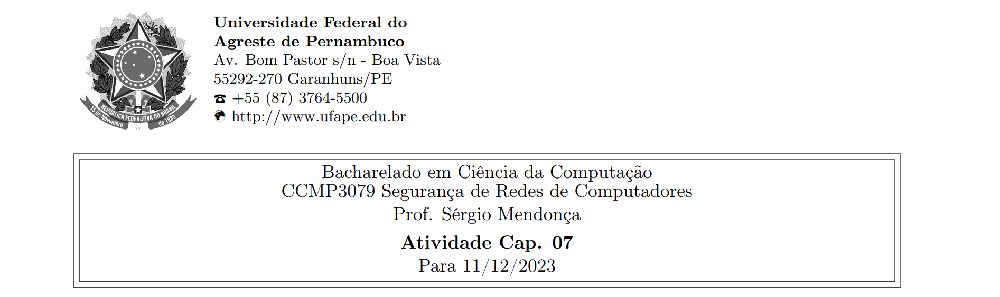



**Nome completo**: Thiago Cavalcanti Silva

Questões retiradas do livro-texto da disciplina. Conforme conversamos em sala de aula, as atividades devem ser realizadas para apresentação e discussão em sala, sempre nas aulas das quintas-feiras, atribuindo ao estudante uma nota de 0 ou 1 por cada atividade realizada e apresentada.

## 1. Qual é a diferença entre aleatoriedades estatísticas e imprevisibilidade?
A aleatoriedade estatística refere-se a gerar uma sequência que pareça aleatória em um sentido estatístico, que passam em alguns testes estatísticos, dando certo grau de confiança de que existe independência entre eles, ou seja, indicando que há algumas propriedades de aleatoriedade. Caso seja gerada por um algoritmo, será previsível para alguém que conheça a forma de gerar e o ponto inicial. Já a imprevisibilidade, significa que cada número é estatisticamente independente dos outros na sequência, ou seja, não é possível prever a sequência mesmo tendo conhecimento do método de geração dela.

&nbsp;

## 2. Liste considerações de projeto importantes para uma cifra de fluxo.
1\. A sequência de encriptação deverá ter um período grande, visto que não é um número verdadeiramente aleatório, deve ser grande para dificultar a criptoanálise. 

2\. O fluxo de chaves deverá se aproximar o máximo possível das propriedades de um fluxo de número aleatório verdadeiro, com a distribuição de bytes com uma frequência aproximada. Quanto maior a aparência aleatória do fluxo de chaves, mais aleatório será o texto cifrado, tornando a criptoanálise mais difícil.

3\. Uma chave de entrada suficientemente grande, para dificultar ataques de força bruta.

&nbsp;

## 3. Por que não é desejável reutilizar uma chave de cifra de fluxo?
Porque se dois textos claros forem encriptados com a mesma chave usando uma cifra de fluxo, então a criptoanálise normalmente é muito simples. Se os dois fluxos de texto cifrado passaram por uma operação XOR, o resultado é o XOR dos textos claros originais.

&nbsp;

## 4. Que operações primitivas são usadas no RC4?
Módulo, troca de bytes e XOR.

&nbsp;

## 5. Se apanharmos um algoritmo de congruência linear com um componente aditivo de 0:
<b>X<sub>n+1</sub> = (aX<sub>n</sub>) mod m</b>

<b>então, podemos mostrar que, se m é primo, e se determinado valor de a produz o período máximo de m − 1, então a<sup>k</sup> também produzirá o período máximo, desde que k seja menor que m e que m − 1 não seja divisível por k. Demonstre isso usando X<sub>0</sub> = 1 e m = 31, e produzindo as sequências para a<sup>k</sup> = 3, 3<sup>2</sup>, 3<sup>3</sup> e 3<sup>4</sup>.</b>

&nbsp;

Calcula o período de um gerador linearmente congruente:

```
def calcular_periodo_GLC(semente, multiplicador, modulo, constante):
    X_0 = semente  # Valor inicial
    sequencia = [X_0]
    
    # Gerando a sequência até encontrar um padrão repetido
    while True:
        x_anterior = sequencia[-1]
        proximo_x = ((multiplicador * x_anterior) + constante) % modulo
        if proximo_x in sequencia:
            periodo = len(sequencia) - sequencia.index(proximo_x)
            return periodo
        sequencia.append(proximo_x)
```

```
modulo = 31
semente = 1
constante = 0
```

```
print("Para m = {}, temos:".format(modulo))

exponentes = [1, 2, 3, 4]
for k in exponentes:
    a = 3 ** k
    resultado = calcular_periodo_GLC(semente, a, modulo, constante)
    print("O período para a = {} é: {}".format(a, resultado))
```

    Para m = 31, temos:
    O período para a = 3 é: 30
    O período para a = 9 é: 15
    O período para a = 27 é: 10
    O período para a = 81 é: 15


Temos que o a = 3 produz o período máximo m \- 1 = 31 \- 1 = 30.

&nbsp;

## 6. (a) Qual é o período máximo que pode ser obtido do seguinte gerador?
<b>X<sub>n+1</sub> = (aX<sub>n</sub>) mod 2<sup>4</sup></b>

&nbsp;

```
modulo = 16
semente = 1
constante = 0
```


```
print("Para m = {}, temos:".format(modulo))

for a in range(1, modulo):
    resultado = calcular_periodo_GLC(semente, a, modulo, constante)
    print("O período para a = {} é: {}".format(a, resultado))
```

    Para m = 16, temos:
    O período para a = 1 é: 1
    O período para a = 2 é: 1
    O período para a = 3 é: 4
    O período para a = 4 é: 1
    O período para a = 5 é: 4
    O período para a = 6 é: 1
    O período para a = 7 é: 2
    O período para a = 8 é: 1
    O período para a = 9 é: 2
    O período para a = 10 é: 1
    O período para a = 11 é: 4
    O período para a = 12 é: 1
    O período para a = 13 é: 4
    O período para a = 14 é: 1
    O período para a = 15 é: 2

De acordo com os testes realizados, variando a e também X<sub>0</sub>, temos que o período máximo é 4.

&nbsp;

**(b) Qual deverá ser o valor de a?**

Verificamos que os números que dão o maior período são 3, 5, 11 ou 13.

&nbsp;

**(c) Que restrições são exigidas na semente?**

Não ser um número no formato 2k, ou seja, ser ímpar. Visto que os testes mostraram que para obter o período máximo a semente não pode ser par.

&nbsp;

## 7. Que valor de chave RC4 deixará S inalterado durante a inicialização? Ou seja, após a permutação inicial de S, as entradas de S serão quais aos valores de 0 a 255 na ordem crescente.
Uma chave de tamanho 255 bytes, com o primeiro byte e o segundo sendo iguais a zero, e os restantes em ordem decrescente (de 255 a 2). Pois, de acordo com o algoritmo, teremos:

K[0] = 0, na primeira iteração.

K[1] = 0, na segunda iteração.

Para a terceira, temos k[2] = 255 e o processe segue até k[255].

k[3]=254;

k[4]=253;

k[5]=252;

...

k[255] = 2.

&nbsp;

## 8. O algoritmo Blum Blum Shub é baseado na teoria dos resíduos quadráticos e utiliza três números inteiros para realizar os cálculos: p, q e s.

**(a) Escolha dois números primos grandes p e q, onde p e q sejam congruentes a 3 mod 4 e não tenham fatores primos comuns. Por exemplo, você pode escolher p = 499 e q = 503.**

Analisando a tabela de primos até mil e verificando se o resto é igual a 3 quando dividido por 4, os números escolhidos foram p = 719 e q = 787.

&nbsp;

**(b) Calcule n = p ∗ q. Neste caso, n seria igual a 499 ∗ 503 = 250997.**

n = 719 \* 787 = 565.853.

&nbsp;

**(c) Escolha um número inteiro s entre 1 e n − 1 que seja co-primo com n. Por exemplo, você pode escolher s = 17.**

7, pois o MDC(565853, 7) = 1.

&nbsp;

**(d) Calcule o valor inicial x<sub>0</sub> = (s<sup>2</sup>) mod n. Neste caso, x<sub>0</sub> seria igual a (17<sup>2</sup>) mod 250997 = 289.**

x<sub>0</sub> = (s<sup>2</sup>) mod n = (7<sup>2</sup>) mod 565853 = 49 mod 565853 = 49.


&nbsp;

**(e) Agora, vamos gerar uma sequência de números aleatórios usando o algoritmo Blum Blum Shub. Para gerar cada número da sequência, use a seguinte fórmula: x<sub>i</sub> = (x<sup>2</sup><sub>i−1</sub>) mod n.**

x<sub>1</sub> = (x<sub>0</sub><sup>2</sup>) mod n = (49<sup>2</sup>) mod 565853 = 2401 mod 565853 = 2401.

x<sub>2</sub> = (x<sub>1</sub><sup>2</sup>) mod n = (2401<sup>2</sup>) mod 565853 = 5764801 mod 565853 = 106271.

&nbsp;

**(f) Execute a fórmula várias vezes para gerar uma sequência de números aleatórios. Por exemplo, você pode executar a fórmula 10 vezes para obter 10 números aleatórios.**

**Aqui está a sequência de números aleatórios gerados usando o algoritmo Blum Blum Shub com os valores do exemplo:**

**289, 253306, 14107, 23546, 67740, 144593, 79829, 46219, 132936, 9863**

**Qual foi a sua sequência?**

x<sub>0</sub> = (s<sup>2</sup>) mod n = (7<sup>2</sup>) mod 565853 = 49 mod 565853 = 49.

x<sub>1</sub> = (x<sub>0</sub><sup>2</sup>) mod n = (49<sup>2</sup>) mod 565853 = 2401 mod 565853 = 2401.

x<sub>2</sub> = (x<sub>1</sub><sup>2</sup>) mod n = (2401<sup>2</sup>) mod 565853 = 5764801 mod 565853 = 106271.

x<sub>3</sub> = (x<sub>2</sub><sup>2</sup>) mod n = (106271<sup>2</sup>) mod 565853 = 1129356794944 mod 565853 = 216600

x<sub>4</sub> = (x<sub>3</sub><sup>2</sup>) mod n = (216600<sup>2</sup>) mod 565853 = 46915560000 mod 565853 = 121917

x<sub>5</sub> = (x<sub>4</sub><sup>2</sup>) mod n = (121917<sup>2</sup>) mod 565853 = 14863754889 mod 565853 = 494138

x<sub>6</sub> = (x<sub>5</sub><sup>2</sup>) mod n = (494138<sup>2</sup>) mod 565853 = 244172363044 mod 565853 = 3308

x<sub>7</sub> = (x<sub>6</sub><sup>2</sup>) mod n = (3308<sup>2</sup>) mod 565853 = 10942864 mod 565853 = 191657

x<sub>8</sub> = (x<sub>7</sub><sup>2</sup>) mod n = (191657<sup>2</sup>) mod 565853 = 36732405649 mod 565853 = 58154

x<sub>9</sub> = (x<sub>8</sub><sup>2</sup>) mod n = (58154<sup>2</sup>) mod 565853 = 3381887716 mod 565853 = 350188

A sequência dos 10 primeiros foi:

49, 2401, 106271, 216600, 121917, 494138, 3308, 191657, 58154 e 350188.

&nbsp;

**Livro-texto da disciplina:** STALLINGS, William. Criptografia e segurança de redes. Princípios e práticas, Ed. 6. 2014
