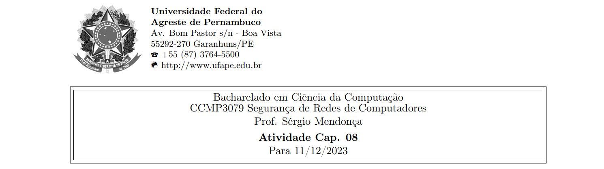



**Nome completo**: Thiago Cavalcanti Silva

Questões retiradas do livro-texto da disciplina. Conforme conversamos em sala de aula, as atividades devem ser realizadas para apresentação e discussão em sala, sempre nas aulas das quintas-feiras, atribuindo ao estudante uma nota de 0 ou 1 por cada atividade realizada e apresentada.

## 1. Por que mdc(n, n + 1) = 1 é para dois inteiros consecutivos n e n + 1?

Supondo que exista um primo p que divide tanto n quanto n+1, ele deveria dividir também a diferença entre eles, ou seja, (n+1) – n. O resultado da diferença é 1, visto que o n subtrai ele mesmo. 

Porém, nenhum número primo pode dividir 1 além dele mesmo, até mesmo porque os primos têm apenas dois divisores, o 1 e o próprio número. Logo, a conclusão é que esse número primo que divide n, n+1 e a diferença entre eles é o 1.

&nbsp;

## 2. Usando o teorema de Fermat, encontre 3201 mod 11.

Pelo teorema, temos que se p é primo e a é um número inteiro positivo não divisível por p, então ap-1 ≡ 1 mod p.

Logo, 310 ≡ 1 mod 11.

Portanto, 3201 = (310)20 x 3 ≡ 3 mod 11.

&nbsp;

## 3. Use o teorema de Fermat para encontrar um número a entre 0 e 72, com a congruente a 9794 módulo 73.

Como 9794 mod 73 é 12, o único número que terá resto 12 quando dividido por 73 nesse intervalo será o próprio 12. Portanto, o número buscando é 12, pois 12 ≡ 9794 mod 73.

&nbsp;

## 4. Use o teorema de Euler para encontrar um número a entre 0 e 9, tal que a seja congruente a 71000 módulo 10. (Observe que isso é o mesmo que o último dígito da expansão decimal de 71000.)

Euler estabelece que aϕ(n) ≡ 1 (mod n).

Como n = 10, temos que ϕ(n) = 4, pois é o tamanho da lista de relativamente primos menores que 10, que é 1, 3, 7 e 9.

Logo, precisamos encontrar a4 ≡ 1 (mod 10).

Temos 14 ≡ 1 (mod 10), logo, um número possível é 1.

&nbsp;

## 5. Use o teorema de Euler para encontrar um número x entre 0 e 28, com x85 congruente a 6 módulo 35 (Você não precisará usar qualquer pesquisa por força bruta).

Primeiramente, vamos decompor x85 em x24 \* x24 x24 \* x13.

Podemos reduzir os três x24 a um, pois xϕ(n) ≡ 1(mod n) e a função totiente de 35 é 24.

a24 = 1 mod (35), então a12 = ± 1 mod(35).

Dessa forma, a85 = a13 = a12a = ± a = 6 mod(35). Então a = 6 ou -6.

Como a solução requer um número entre 0 e 28, temos que x é igual a 6.

&nbsp;

## 6. Observe, na Tabela 8.2, que ϕ(n) é par para n > 2. Isso é verdadeiro para todo n > 2. Dê um argumento conciso para explicar por que isso acontece.

A função totiente ϕ(n) conta quantos números inteiros menores que n são coprimos com n (ou seja, não têm fatores em comum com n além do 1).

Se temos um número a que é coprimo com n (ou seja, não tem nenhum fator em comum com n além do 1), então n−a também é coprimo com n. Ou seja, gcd(a,n) = 1 e gcd(n−a,n) = 1. Isso acontece porque, se a não compartilha nenhum fator com n, então n−a não pode compartilhar os mesmos fatores de a (senão, n e a teriam um fator em comum).

Então, para cada a coprimo com n, há um n−a correspondente que também é coprimo com n. 

Por exemplo, para n = 10, temos:

- 1 é coprimo com 10, e 10 - 1 = 9 também é coprimo com 10.
- 3 é coprimo com 10, e 10 - 3 = 7 também é coprimo com 10.
- O mesmo vale para o 7 e para o 9, pois a diferença com 10 será coprimo como visto acima.

Em resumo, os coprimos são emparelhados, deixando um número par de elementos no total.

&nbsp;

## 7. Se n é composto e passa no teste de Miller-Rabin para a base a, então n é chamado de pseudo-primo forte à base a. Mostre que 2047 é um pseudoprimo à base 2.

Seguindo o algoritmo no livro, temos:

No passo 1 da função de teste, definimos k = 1 e q = 1023, pois (2047 – 1) = (21) \* (1023). 

Na etapa 2, selecionamos a = 2 como base.

No passo 3, temos aq mod n = 21023 mod 2047 = (211)93 mod 2047 = (2048)93 mod 2047 = 1. Portanto, o teste foi aprovado.

&nbsp;

## 8. O exemplo usado por Sun-Tsu para ilustrar o CRT foi x ≡ 2 (mod 3); x ≡ 3 (mod 5); x ≡ 2 (mod 7). Solucione para x.
Temos M = 3 x 5 x 7 = 105;

M/3 = 35; 

M/5 = 21;

M/7 = 15.

O conjunto de congruências lineares, tem as soluções:

35b1 ≡ 1 (mod 3) &rarr;  b1 = 2

21b2 ≡ 1 (mod 5) &rarr;  b2 = 1

15b3 ≡ 1 (mod 7) &rarr;  b3 = 1

Então, x ≡ 2 \* 2 \* 35 + 3 \* 1 \* 21 + 2 \* 1 \* 15 \* 233 (mod 105) = 23.

&nbsp;

**Livro-texto da disciplina:** STALLINGS, William. Criptografia e segurança de redes. Princípios e práticas, Ed. 6. 2014
