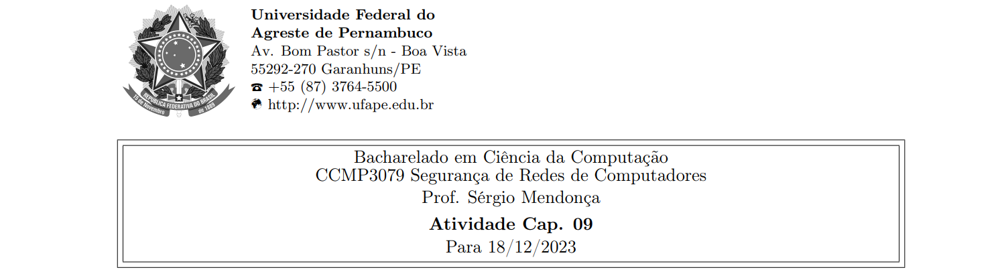



**Nome completo**: Thiago Cavalcanti Silva

Questões retiradas do livro-texto da disciplina. Conforme conversamos em sala de aula, as atividades devem ser realizadas para apresentação e discussão em sala, sempre nas aulas das quintas-feiras, atribuindo ao estudante uma nota de 0 ou 1 por cada atividade realizada e apresentada.

## 1. Quais são os principais elementos de um criptossistema de chave pública?

- Texto claro: a mensagem com o conteúdo original que será encriptada.
- Algoritmo de criptografia: o processo que executará transformações no texto claro, para criptografá-lo.
- Chaves públicas e privadas: uma destinada para criptografar e outra para descriptografar.
- Texto cifrado: mensagem embaralhada, produzida como saída do algoritmo de criptografia. Varia conforme o texto claro e a chave utilizada.
- Algoritmo de descriptografia: recebe o texto cifrado e a chave correspondente, executando transformações para produzir o texto claro original.

&nbsp;

## 2. Quais são os papéis da chave pública e da privada? Descreva-os com detalhes e com exemplos.

A chave privada de um usuário é mantida privada e conhecida apenas pelo usuário. A chave pública do usuário é disponibilizada para uso de outras pessoas. 

A chave privada pode ser usada para criptografar uma assinatura que pode ser verificada por qualquer pessoa que possua a chave pública. 

Isto é, a chave pública pode ser usada para criptografar informações que só podem ser descriptografadas pelo possuidor da chave privada.

Por exemplo, supondo que Alice queira enviar uma mensagem segura para Bob.

Alice encripta a mensagem usando a chave pública de Bob, que qualquer pessoa pode possuir. Esta mensagem será lida apenas através da decriptação da chave privada de Bob, que somente ele possui.

&nbsp;

## 3. Quais requisitos os criptossistemas de chave pública precisam cumprir para serem considerados como um algoritmo seguro?

1\. É computacionalmente fácil para uma parte B gerar um par (chave pública PUb, chave privada PRb). 

2\. É computacionalmente fácil que um emissor A, conhecendo a chave pública e a mensagem a ser encriptada, M, gere o texto cifrado correspondente: C = E(PUb, M)

3\. É computacionalmente fácil que o receptor B decripte o texto cifrado resultante usando a chave privada para recuperar a mensagem original: M = D(PRb, C) = D[PRb, E(PUb, M)] 

4\. É computacionalmente inviável que um invasor, conhecendo a chave pública, PUb, determine a chave privada, PRb. 

5\. É computacionalmente inviável que um invasor, conhecendo a chave pública, PUb, e um texto cifrado, C, recupere a mensagem original, M.

&nbsp;

## 4. Descreva, em termos gerais, um procedimento eficiente para se escolher um número primo.

1\. Escolha um número inteiro ímpar n aleatoriamente (por exemplo, usando um gerador de números pseudoaleatórios).

2\. Escolha um número inteiro a < n aleatoriamente.

3\. Realize o teste probabilístico de primalidade, como Miller-Rabin. Se n falhar no teste, rejeite o valor n e vá para a etapa 1.

4\. Se n passou em um número suficiente de testes, aceite n; caso contrário, vá para a etapa 2.

&nbsp;

## 5. Antes da descoberta de quaisquer esquemas de chave pública específicas, como RSA, uma prova de existência foi desenvolvida, cuja finalidade era demonstrar que a encriptação de chave pública é possível em teoria. Considere as funções f1(x1) = z1; f2(x2, y2) = z2; f3(x3, y3) = z3, onde todos os valores são inteiros com 1 ≤ xi , yi , zi ≤ N. A função f1, pode ser representada por um vetor M1 de tamanho N, em que a k-ésima entrada é o valor de f1(k). De modo semelhante, f2 e f3 podem ser representados pelas matrizes M2 e M3 de tamanho N × N. A intenção é indicar o processo de encriptação/decriptação por pesquisas de tabela para aquelas com valores muito grandes de N. Essas tabelas seriam impraticavelmente grandes, mas, a princípio, poderiam ser construídas. O esquema funciona da seguinte forma: construa M1 com uma permutação aleatória de todos os inteiros entre 1 e N; ou seja, cada inteiro aparece exatamente uma vez em M1. Construa M2, de modo que cada linha contenha uma permutação aleatória dos primeiros N inteiros. Finalmente, preencha M3 para satisfazer a seguinte condição:</b>  

<b>f3(f2(f1(k), p), k) = p para todo k, p com 1 ≤ k, p ≤ N</b>

**Resumindo,** 

**1. M1 toma uma entrada k e produz uma saída x.** 

**2. M2 toma as entradas x e p, dando a saída z.** 

**3. M3 toma as entradas z e k e produz p.**

**As três tabelas, uma vez construídas, se tornam públicas.**

**(a) Deverá ficar claro que é possível construir M3 para satisfazer a condição anterior. Como um exemplo, preencha M3 para o caso simples a seguir:**

**Convenção: o i-ésimo elemento de M1 corresponde a k = i. A i-ésima linha de M2 diz respeito ax = i; a j-ésima coluna de M2 equivale a p = j. A i-ésima linha de M3 indica z = i; a j-ésima coluna de MB relaciona-se a k = j.**

&nbsp;

**(b) Descreva o uso desse conjunto de tabelas para realizar a encriptação e decriptação entre dois usuários.** 

Suponha que uma mensagem de texto simples m seja criptografada por Alice e enviada a Bob. Bob usa M1 e M3 e Alice usa M2. Bob escolhe um número aleatório, k, como sua chave privada e mapeia k por M1 para obter p, que ele envia como sua chave pública para Alice. Alice usa p para criptografar m com M2 para obter c, o texto cifrado, que ela envia para Bob. Bob usa k para descriptografar c por meio de M3, produzindo a mensagem de texto simples m.

&nbsp;

**(c) Demonstre que esse é um esquema seguro.**

Se os números forem grandes o suficiente e M1 e M2 forem suficientemente aleatórios para tornar impraticável trabalhar de trás para frente, a mensagem de texto simples m não poderá ser encontrada sem conhecer a chave privada de Bob k.

&nbsp;

## 6. Realize a encriptação e decriptação usando o algoritmo RSA, como na Figura 9.5, para o seguinte:

Passo 1: calcular n

Passo 2: calcular ϕ(n)

Passo 3: encontrar d (chave privada) &rarr; é o inverso multiplicativo de e módulo ϕ(n)

Passo 4: encriptar

Passo 5: decriptar

**(a) p = 3; q = 11, e = 7; M = 5;** 

n = p\*q = 3 \* 11 = 33

ϕ(n) = (p-1) \* (q-1) = (3-1) \* (11-1) = 2 \* 10 = 20

d \* e ≡ 1 mod ϕ(n) &rarr; d \* 7 ≡ 1 mod 20 &rarr; 3, pois 21/20 deixa resto = 1. Logo, d = 3.

C = Me mod n = 57 mod 33 = 78125 mod 33 = 14

M = Cd mod n = 143 mod 33 = 2744 mod 33 = 5

&nbsp;

**(b) p = 5; q = 11, e = 3; M = 9;** 

n = p\*q = 5 \* 11 = 55

ϕ(n) = (p-1) \* (q-1) = (5-1) \* (11-1) = 4 \* 10 = 40

d \* e ≡ 1 mod ϕ(n) &rarr; d \* 3 ≡ 1 mod 40 &rarr; 27, pois 81/40 deixa resto = 1. Logo, d = 27.

C = Me mod n = 93 mod 55 = 729 mod 55 = 14

M = Cd mod n = 1427 mod 55 = 9

&nbsp;

**(c) p = 7; q = 11, e = 17; M = 8;** 

n = p\*q = 7 \* 11 = 77

ϕ(n) = (p-1) \* (q-1) = (7-1) \* (11-1) = 6 \* 10 = 60

d \* e ≡ 1 mod ϕ(n) &rarr; d \* 17 ≡ 1 mod 60 &rarr; 53, pois 901/60 deixa resto = 1. Logo, d = 53.

C = Me mod n = 817 mod 77 = mod 77 = 2251799813685248 mod 77 = 57

M = Cd mod n = 5753 mod 77 = 8

&nbsp;

**(d) p = 11; q = 13, e = 11; M = 7;** 

n = p\*q = 11 \* 13 = 143

ϕ(n) = (p-1) \* (q-1) = (11-1) \* (13-1) = 10 \* 12 = 120

d \* e ≡ 1 mod ϕ(n) &rarr; d \* 11 ≡ 1 mod 120 &rarr; 11, pois 121/120 deixa resto = 1. Logo, d = 11.

C = Me mod n = 711 mod 143 = 1977326743 mod 143 = 106

M = Cd mod n = 10611 mod 143 = 7

&nbsp;

**(e) p = 17; q = 31, e = 7; M = 2.**

n = p\*q = 17 \* 31 = 527

ϕ(n) = (p-1) \* (q-1) = (17-1) \* (31-1) = 16 \* 30 = 480

d \* e ≡ 1 mod ϕ(n) &rarr; d \* 7 ≡ 1 mod 480 &rarr; 343, pois 2401/480 deixa resto = 1. Logo, d = 343.

C = Me mod n = 27 mod 527 = 128 mod 527 = 128

M = Cd mod n = 128343 mod 527 = 2

&nbsp;

**Dica:** a decriptação não é tão difícil quanto você pensa; use alguma sutileza.

&nbsp;

## 7. Em um sistema de chave pública usando RSA, você intercepta o texto cifrado C = 10 enviado a um usuário cuja chave pública é e = 5, n = 35. Qual é o texto claro M?

M = Cd mod n

M = 10d mod 35

Precisamos calcular a chave privada d usando a relação e \* d mod ϕ(n) = 1.

Para n = 35, os fatores primos são 5 e 7. Logo, ϕ(n) = (5-1) \* (7-1) = 4 \* 6 = 24.

Buscando d, tal que 5\*d mod 24 = 1, temos que o valor de d é 5.

Retornando a decriptação, temos: M = 105 mod 35 = 100000 mod 35 = 5.

&nbsp;

**Livro-texto da disciplina:** STALLINGS, William. Criptografia e segurança de redes. Princípios e práticas, Ed. 6. 2014
