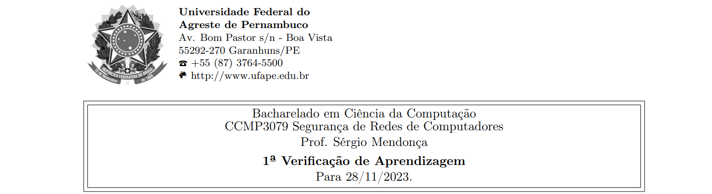
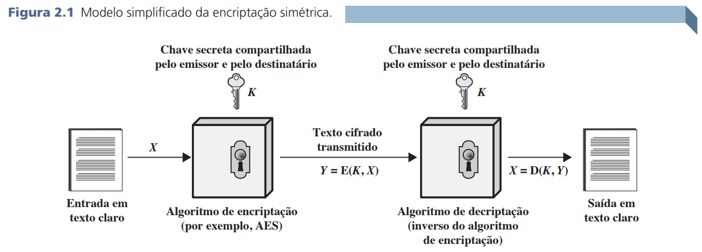
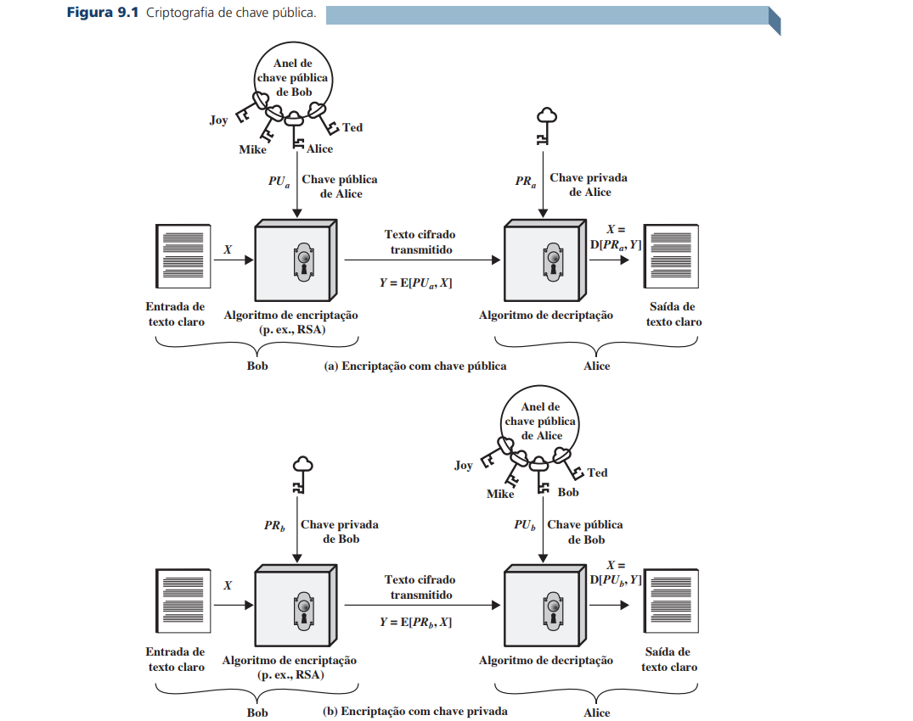
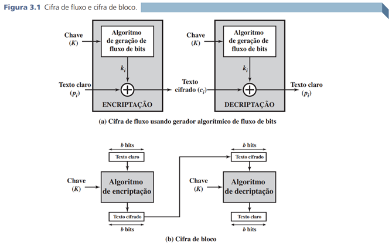
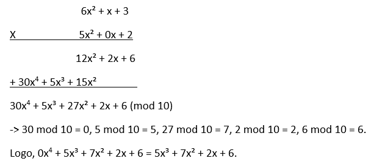
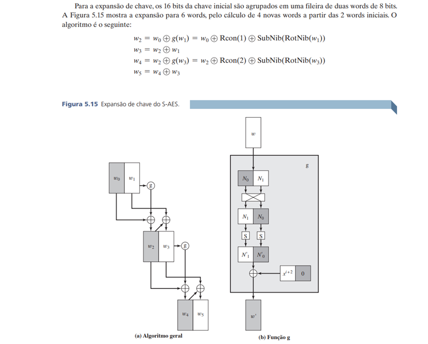
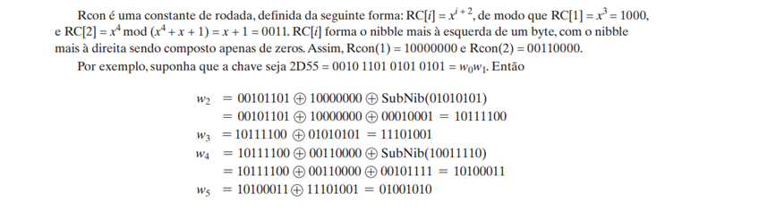



**Nome completo**: Thiago Cavalcanti Silva

Questões retiradas do livro-texto da disciplina. 

## 1. Para cada um dos seguintes recursos, determine um nível de impacto baixo, moderado ou alto à perda de confidencialidade, disponibilidade e integridade, respectivamente. Justifique suas respostas.

**(a) uma organização gerenciando informações públicas em seu servidor web.** 

- Não se aplica: como as informações são públicas, não há impacto no quesito confidencialidade.

- Moderado: os dados devem ser retornados íntegros ao serem consultados pelos usuários.

- Moderado: os dados devem estar disponíveis, mas não necessariamente durante todo o tempo podendo haver momentos em que não haja retorno sem impactar tanto ao usuário.

&nbsp;

**(b) uma organização de aplicação da lei gerindo informações de investigação extremamente sensíveis.** 

- Alto: como as informações são extremamente sensíveis, devem ser confidenciais, logo, a perda de confidencialidade gera um alto impacto.

- Moderado/alto: os dados devem ser íntegros para não enviesar a investigação.

- Baixo/moderado:  a indisponibilidade temporária não atrapalharia a investigação, pois as informações poderão ser verificadas em outro momento.

&nbsp;

**(c) uma organização financeira gerindo informações administrativas rotineiras (sem informações relacionadas à privacidade).** 

- Baixo: como as informações não ferem a privacidade dos clientes/envolvidos, não há um impacto grande no quesito confidencialidade.

- Baixo: como são informações administrativas de rotina, não teria um alto impacto caso o dado não estivesse íntegro.

- Baixo: nesse caso, os dados poderiam ficar indisponíveis por algum intervalo sem grandes impactos. 

&nbsp;

**(d) um sistema de informação utilizado para grandes aquisições em uma organização voltada a contratações que contém dados sensíveis da fase de pré-solicitação e dados administrativos rotineiros. Avalie o impacto de haver dois conjuntos de dados separadamente e o sistema de informação único.** 

Para as informações de contratação:

- Moderado/alto: como se trata de dados sensíveis, exige confidencialidade pois pode conter documentação ou informações sobre se o candidato prossegue no processo seletivo.

- Moderado/alto: para não enviesar a seleção, o dado deve permanecer íntegro.

- Baixo: o sistema poderia ser consultado em outro momento sem maiores problemas.

Para as informações de rotina, seria baixo para todos. Visto que não envolve privacidade e necessidade de consulta a todo momento. E caso fosse alterado, não causaria grandes impactos.

&nbsp;

**(e) uma indústria de energia contém um sistema SCada (controle supervisório e aquisição de dados, do acrônimo em inglês para supervisory control and data acquisition) controlando a distribuição da energia elétrica para uma grande instalação militar. O sistema SCada contém tanto sensores de dados em tempo real quanto informações das rotinas administrativas. Avalie o impacto de haver dois conjuntos de dados separadamente e o sistema de informação único.**

Para a gestão da energia elétrica:

 - Baixo: não há impacto na perda de confidencialidade nos dados dos sensores.

 - Alto: o dado deverá retratar a realidade, refletindo o cenário medido pelos sensores.

 - Alto: para garantir a observabilidade, o dado deve estar disponível a todo momento.

Para as informações de rotinas administrativas, todos os impactos seriam baixos, visto que não há sensibilidade dos dados (privacidade), nem necessidade de acesso a qualquer momento. E caso fosse modificado, não causaria grandes impactos.

&nbsp;

## 2. Responda, explique com exemplos, as questões abaixo:

**(a) Quais são os elementos essenciais de uma cifra simétrica? Explique-as.** 

- Texto claro: mensagem original.
- Algoritmo de encriptação: realiza substituições e transformações no texto claro.
- Chave secreta: um valor independente do texto e do algoritmo, que também é entrada para o algoritmo e varia a saída do texto.
  Texto cifrado: mensagem embaralhada produzida pelo algoritmo.
- Algoritmo de decriptação: inverso da encriptação, recebe o texto cifrado e a chave e retorna o texto original.

&nbsp;

**(b) Quais são as duas funções básicas usadas nos algoritmos de encriptação? Explique-as.** 

Substituição (mapeamento de cada elemento do texto claro em outro elemento) e transposição (rearranjo dos elementos do texto claro).

&nbsp;

**(c) Quantas chaves são necessárias para duas pessoas se comunicarem por meio de uma cifra? Explique-as, demonstrando, você pode se utilizar de gráficos ou desenhos.** 

Caso seja uma cifra simétrica, apenas uma chave, pois ela codifica e também decodifica.



Se for uma cifra assimétrica, são necessárias duas chaves. Uma pública e uma privada, onde uma será utilizada para codificar e o texto somente será decodificado pela outra, garantindo a integridade.



&nbsp;

**(d) Quais são as duas técnicas gerais para atacar uma cifra? Explique-as.** 

Criptoanálise (explora o algoritmo e talvez características ou amostras de pares de texto claro-texto cifrado) e ataque por força bruta (teste de todas as chaves possíveis).

&nbsp;

**(e) Defina resumidamente a cifra de César; a cifra de Hill; a cifra de Feistel (por que é importante estudá-la?); e, a diferença entre DES, Rijndael e AES.**

A cifra de César é uma substituição de cada letra do alfabeto por uma letra, através de um deslocamento de 3 posições (podendo ser generalizada) módulo 26 (para tornar-se cíclico). Ou seja, a letra A vira D, a letra B transforma-se em E, a letra Z será o C, e daí em diante.

A cifra de Hill é um algoritmo que utiliza matrizes para encriptar o texto. O texto claro é dado pelo módulo 26 da multiplicação do texto cifrado com a matriz que representa a chave.

A cifra de Feistel é uma cifra de produto que alterna entre funções de substituição e permutação. É importante estudá-la pois oferece um modelo que foi usado como base para várias outras cifras simétricas, ou seja, além de sua importância histórica, auxilia no entendimento de alguns conceitos e etapas utilizados por outras cifras.

A diferença entre o AES e o DES é o tamanho da chave, segurança e velocidade, que são atributos melhores no AES. Além disso, as operações que estão envolvidas no processo do algoritmo. Por exemplo, no DES há permutação da metade dos dados a cada rodada, já no AES há ShiftRows e MixColumns para embaralhar os dados.

o AES, trabalha com 128 bits de comprimento de bloco e a chave pode ser de 128, 196 ou 256 bits. Já o Rijndael pode ser implementado para diferentes comprimentos de bloco de texto claro e de chave, como 128, 160, 190, 222 e 256 bits. Em resumo, o AES é uma implementação específica do Rijndael (um subconjunto do Rijndael).

&nbsp;

## 3. Quando o barco de patrulha norte-americano PT-109, sob o comando do tenente John f. Kennedy, foi afundado por um destróier japonês, uma mensagem foi recebida na estação sem fio australiana em código playfair:

**KXJEY UREBE ZWEHE WRYTU HEYFS** 

**KREHE GOYFI WTTTU OLKSY CAJPO**

**BOTEI ZONTX BYBNT GONEY CUZWR**

**GDSON SXBOU YWRHE BAAHY USEDQ**

**A chave usada foi royal new zealand navy. decripte a mensagem. traduza TT para tt.**

O algoritmo Playfair utiliza matriz 5 × 5 de letras determinadas pela chave, removendo as duplicatas. O restante, serão as letras restantes em ordem alfabética, onde i e j se comportam como uma só. Nesse caso, temos:

|R|O|Y|A|L|
| :-: | :-: | :-: | :-: | :-: |
|N|E|W|Z|D|
|V|B|C|F|G|
|H|I/J|K|M|P|
|Q|S|T|U|X|

A cifra de Playfair possui as seguintes regras:

1. Letras de texto claro repetidas que estão no mesmo par são separadas por uma de preenchimento, como x, de modo que balloon seria tratado como ba lx lo on.

2. Duas letras de texto claro que estejam na mesma linha da matriz são substituídas pela letra à direita, com o primeiro elemento da linha vindo após o último, de forma rotativa. Por exemplo, ‘al’ é encriptado como ‘LR’. 

3. Duas letras de texto claro que estejam na mesma coluna são substituídas pela letra abaixo, com o elemento de cima da coluna vindo após o último, de forma rotativa. Por exemplo, ‘rq’ é encriptado como ‘NR’. 

4. Caso contrário, cada letra de texto claro em um par é substituída por aquela que esteja em sua própria linha e na coluna ocupada pela outra letra de texto claro. Assim, ‘em’ torna-se ‘ZI’ (ou ‘ZJ’, a critério do cifrador).

No caso da regra 2 e 3, para decriptar é o inverso (pega a letra da esquerda ou a de cima, respectivamente).

&nbsp;

Dessa forma, temos:

KX = PT (regra 4)

JE = BO (regra 3)

YU = AT (regra 4)

RE = ON (regra 4)

BE = EO (regra 3)

ZW = WE (regra 2)

EH = NI (regra 4)

EW = NE (regra 2)

RY = LO (regra 2)

TU = ST (regra 2)

HE = IN (regra 4)

YF = AC (regra 4) 

SK = TI (regra 4)

RE = ON (regra 4)

HE = IN (regra 4)

GO = BL (regra 4)

|R|O|Y|A|L|
| :-: | :-: | :-: | :-: | :-: |
|N|E|W|Z|D|
|V|B|C|F|G|
|H|I/J|K|M|P|
|Q|S|T|U|X|

YF = AC (regra 4)

IW = KE (regra 4)

TT = TT (regra 4)

TU = ST (regra 2)

OL = RA (regra 2)

KS = IT (regra 4)

YC = TW (regra 3)

AJ = OM (regra 4)

PO = IL (regra 4)

BO = ES (regra 3)

TE = SW (regra 4)

IZ = ME (regra 4)

ON = RE (regra 4)

TX = SU (regra 2)

BY = CO (regra 4)

BN = VE (regra 4)

TG = XC (regra 4)

ON = RE (regra 4)

|R|O|Y|A|L|
| :-: | :-: | :-: | :-: | :-: |
|N|E|W|Z|D|
|V|B|C|F|G|
|H|I/J|K|M|P|
|Q|S|T|U|X|

EY = WO (regra 4)

CU = FT (regra 4)

ZW = WE (regra 2) 

RG = LV (regra 4)

DS = EX (regra 4)

ON = RE (regra 4) 

SX = QU (regra 2)

BO = ES (regra 3)

UY = TA (regra 4)

WR = NY (regra 4)

HE = IN (regra 4)

BA = FO (regra 4)

AH = RM (regra 4)

YU = AT (regra 4)

SE = IO (regra 3)

DQ = NX (regra 4) = N (regra 1)

Dessa forma, o texto claro correspondente a mensagem cifrada é:

PT BOAT ONE OWE NINE LOST IN ACTION IN BLACKETT STRAIT TWO MILES SW MERESU COVE X CREW OF TWELVE X REQUEST ANY INFORMATION 

&nbsp;

## 4. Crie uma aplicação que possa encriptar e decriptar usando uma cifra de Hill 2 × 2.

Funções auxiliares para a matriz:

```
def ler_matriz_chave():
    while True:
        try:
            entrada = input("Informe os elementos da matriz 2x2 separados por espaços (exemplo: 1 2 3 4): ")
            elementos = list(map(int, entrada.split()))
            if len(elementos) == 4:
                return elementos
                break
            else:
                print("Você deve fornecer exatamente 4 números separados por espaços.")
        except ValueError:
            print("Por favor, insira números inteiros válidos.")
```

```
def criar_matriz_2x2(elementos):
    return matrix([ [elementos[0], elementos[1]], [elementos[2], elementos[3]] ])
```

```
def obter_determinante(matriz_chave):
    return matriz_chave.determinant()
```

```
def obter_inverso_multiplicativo_modular(determinante):
    return inverse_mod(determinante, 26)
```

```
def obter_matriz_inversa(matriz_chave):
    return matriz_chave^-1
```

```
def obter_matriz_decodificadora(matriz_chave):
    determinante = obter_determinante(matriz_chave)
    
    inverso_multiplicativo_modular = obter_inverso_multiplicativo_modular(determinante)
    
    matriz_inversa = obter_matriz_inversa(matriz_chave)
    matriz_inversa = matriz_inversa * matriz_chave.determinant()
    
    return (inverso_multiplicativo_modular * matriz_inversa) % 26
```

Funções auxiliares para a encriptação:

```
def quebrar_frase_em_blocos(texto_claro, tamanho_do_bloco):
    blocos = []
    for i in range(0, len(texto_claro), tamanho_do_bloco):
        blocos.append(texto_claro[i:i+tamanho_do_bloco].lower())
    return blocos
```

```
def converter_par_para_matriz_numerica(bloco):
    matriz = Matrix(2, 1, [caractere_para_numero(bloco[0]), caractere_para_numero(bloco[1])])
    return matriz
```

Funções para casos em que a string não pode ser dividida perfeitamente pelo tamanho do bloco

```
def adicionar_caractere_repetido(texto):
    texto += texto[-1]
    return texto
```

```
def remover_caractere_repetido(texto):
    return texto[:-1]
```

#### Encriptação com a cifra de Hill 2x2

```
def encriptar_por_hill(texto_claro, matriz_chave):
    if repete_a_ultima_letra:
        texto_claro = adicionar_caractere_repetido(texto_claro)
    
    blocos_do_texto_claro = quebrar_frase_em_blocos(texto_claro, 2)
    # print(f'Frase quebrada em blocos de 2 em 2 caracteres: {blocos_do_texto_claro}')
    
    texto_cifrado = ''
    
    for par in blocos_do_texto_claro:
        matriz_do_bloco = converter_par_para_matriz_numerica(par)
        resultado = matriz_chave * matriz_do_bloco
        resultado = resultado.apply_map(lambda x: x % 26)
        texto_cifrado += numero_para_caractere(resultado[0, 0]) + numero_para_caractere(resultado[1, 0])
    
    return texto_cifrado.upper()
```

#### Decriptação com a cifra de Hill 2x2

```
def decriptar_por_hill(texto_cifrado, matriz_chave):
    blocos_do_texto_cifrado = quebrar_frase_em_blocos(texto_cifrado, 2)
    # print(f'Frase quebrada em blocos de 2 em 2 caracteres: {blocos_do_texto_cifrado}')
    
    matriz_decodificadora = obter_matriz_decodificadora(matriz_chave)

    texto_decifrado = ''
    
    for par in blocos_do_texto_cifrado:
        matriz_do_bloco = converter_par_para_matriz_numerica(par)
        resultado = matriz_decodificadora * matriz_do_bloco
        resultado = resultado.apply_map(lambda x: x % 26)
        texto_decifrado += numero_para_caractere(resultado[0, 0]) + numero_para_caractere(resultado[1, 0])
        
    if repete_a_ultima_letra:
        texto_decifrado = remover_caractere_repetido(texto_decifrado)

    return texto_decifrado.lower()
```

Obtendo dados do terminal \(chave e frase\):

```
#elementos = ler_matriz_chave()
elementos = [9, 4, 5, 7]
matriz_chave = criar_matriz_2x2(elementos)
matriz_chave
```

    Informe os elementos da matriz 2x2 separados por espaços (exemplo: 1 2 3 4):  9 4 5 7

```
#texto_claro = input("Digite uma frase a ser cifrada com Hill 2x2: ")
texto_claro = 'meet me at the usual place at ten rather than eight oclock'

texto_claro_sem_espacos = texto_claro.replace(" ", "")
repete_a_ultima_letra = len(texto_claro_sem_espacos) % 2 == 1 # Se o tamanho da palavra for ímpar, repete a última para formar o bloco
```

```
texto_cifrado = encriptar_por_hill(texto_claro_sem_espacos, matriz_chave)
print(f'O texto cifrado por Hill é: {texto_cifrado}')

texto_decifrado = decriptar_por_hill(texto_cifrado, matriz_chave)
print(f'O texto decifrado por Hill é: {texto_decifrado}')
```

    O texto cifrado por Hill é: GVUIGVKODZYPUHEKJHUZWFZFWSJSDZMUDZMYCJQMFWWUQRMB
    O texto decifrado por Hill é: meetmeattheusualplaceattenratherthaneightoclock

&nbsp;

## 5. Responda, resumidamente, as questões a seguir:

**(a) Qual é a diferença entre uma cifra de bloco e uma cifra de fluxo?** 

A cifra em fluxo, processa os elementos continuamente, retornando a saída de um elemento de cada vez, ou seja, encripta um fluxo de dados digital um bit ou um byte por vez.

Já a de bloco processa a entrada de um bloco de elementos por vez, produzindo a saída para cada um deles, isto é, um bloco de texto claro é tratado como um todo e usado para produzir um de texto cifrado com o mesmo tamanho.



&nbsp;

**(b) O que é uma cifra de produto?** 

A execução de duas ou mais cifras simples em sequência, de tal forma que o resultado ou produto final seja criptograficamente mais forte do que qualquer uma das cifras componentes, por exemplo, a cifra de Feistel.

&nbsp;

**(c) Qual é a diferença entre difusão e confusão? Explique.**

A confusão é quando a estrutura estatística do texto claro é dissipada em estatísticas de longa duração do texto cifrado. Ou seja, ela busca tornar o relacionamento estatístico entre o texto claro e o texto cifrado o mais complexo possível, a fim de frustrar tentativas de deduzir a chave. Isso é obtido fazendo-se que cada dígito do texto claro afete o valor de muitos do texto cifrado.

Enquanto a difusão procura estabelecer o relacionamento entre as estatísticas do texto cifrado e o valor da chave de encriptação o mais complexo possível, novamente para frustrar tentativas de descobrir a chave. Assim, mesmo que o atacante possa ter alguma ideia das estatísticas do texto cifrado, o modo pelo qual a chave foi usada para produzir esse texto cifrado é tão complexo que torna difícil deduzir a chave.

&nbsp;

**(d) Quais parâmetros e escolhas de projeto determinam o algoritmo real de uma cifra de Feistel?** 

Tamanho de bloco, tamanho da chave, número de rodadas, algoritmo de geração de subchave e função F.

&nbsp;

**(e) Explique o efeito avalanche.**

Quando uma pequena mudança no texto claro ou na chave produza uma alteração significativa no texto cifrado. Em particular, uma mudança em um bit do texto claro ou um bit da chave deverá produzir uma modificação em muitos bits do texto cifrado.

&nbsp;

## 6. Encontre o inverso multiplicativo de cada elemento diferente de zero em Z<sub>5</sub>.

O inverso multiplicativo de um elemento em um conjunto Zn (conhecido como anel de números inteiros módulo n) é um elemento que, quando multiplicado pelo elemento original, resulta em 1.

0: não existe

1: 1 \* x ≡ 1 (mod 5) à x = 1, pois 1 mod 5 = 1.

2: 2 \* x ≡ 1 (mod 5) à x = 3, pois 6 mod 5 = 1.

3: 3 \* x ≡ 1 (mod 5) à x = 2, pois 6 mod 5 = 1.

4: 4 \* x ≡ 1 (mod 5) à x = 4, pois 16 mod 5 = 1.

&nbsp;

## 7. Para a aritmética de polinômios com coeficientes em Z<sub>10</sub>, realize os seguintes cálculos:

<b>(a) (7x + 2) − (x<sup>2</sup> + 5)</b>

0x² + 7x + 2

<u>- x² - 0x - 5</u>

-x² + 7x -3 (mod 10) = 9x² + 7x + 7

&nbsp;

<b>(b) (6x<sup>2</sup> + x + 3) × (5x<sup>2</sup> + 2)</b>



&nbsp;

## 8. Use a chave 1010 0111 0011 1011 para encriptar o texto claro "ok" conforme expresso em ASCII, ou seja, 0110 1111 0110 1011. Os projetistas do S-AES obtiveram o texto cifrado 0000 0111 0011 1000. E você?

Começamos pela expansão de chave através do algoritmo:





Dessa forma, temos as seguintes chaves:

w<sub>0</sub> = 1010 0111 

w<sub>1</sub> = 0011 1011 

w<sub>2</sub> = 0001 1100 

w<sub>3</sub> = 0010 0111

w<sub>4</sub> = 0111 0110 

w<sub>5</sub> = 0101 0001

Agora podemos começar as rodadas do algoritmo de encriptação.

Rodada 0:
Inclusão de chave: realizamos um XOR bit a bit entre a chave inicial e o texto expresso em bytes, que nos resulta 1100 1000 0101 0000.

&nbsp;

Rodada 1: 

Substituição de nibble: a pesquisa na tabela da S-box, resulta em 1100 0110 0001 1001.

Deslocamento de linha: realiza um deslocamento circular de um nibble da segunda linha da matriz de Estado, mas a primeira linha não é alterada. Resultado: 1100 1001 0001 0110

Embaralhamento de colunas: opera sobre cada coluna individualmente, mapeando cada nibble para um novo valor através da multiplicação sobre a matriz de estado. Nesse caso, retornou 1110 1100 1010 0010.

Após a inclusão de chave de rodada: 1110 1100 1010 0010.

&nbsp;

Rodada 2:

Substituição de nibble: 1111 0000 1000 0101

Deslocamento de linha: 0111 0001 0110 1001

Após incluir a chave da rodada (XOR com w<sub>4</sub> e w<sub>5</sub>): 0000 0111 0011 1000, que é o texto cifrado. 

&nbsp;

## 9. Compare AES com DES. Para cada um dos seguintes elementos do DES, indique o elemento comparável no AES ou explique por que ele não é necessário no AES.

**(a) XOR do material da subchave com a entrada da função f.**

A transformação respectiva no AES é a AddRoundKey (transformação direta de adição de chave da rodada), onde os bits de estado passam por um XOR bit a bit com os bits da chave da rodada.

&nbsp;

**(b) XOR da saída da função f com a metade esquerda do bloco.**

Analisando a interação dos bits uns com os outros, essa etapa se assemelha ao MixColumn, onde há o embaralhamento das colunas.

&nbsp;

**(c) função f.**

A SubByte, pois utiliza a tabela S-box para substituir bytes, de forma que o mapeamento para uma saída qualquer a cada entrada quebra a linearidade da resposta.

&nbsp;

**(d) permutação P.**

Seria a etapa ShiftRow, pois realiza um deslocamento à esquerda, permutando os bytes.

&nbsp;

**(e) troca de metades do bloco.**

Não há uma troca de linhas ou colunas entre uma etapa e outra, como no DES. Como o MixColumn já realiza o embaralhamento de todos os outros bytes da coluna, não há necessidade de trocar linhas. Já a ShiftRow, move bytes de uma coluna para outra a cada linha (com exceção da primeira), dessa forma, não há necessidade de trocar colunas.

&nbsp;

## 10. Calcule a saída da transformação MixColumns para a seguinte sequência de bytes de entrada "67 89 AB CD". Aplique a transformação InvMixColumns ao resultado obtido para verificar seus cálculos. Altere o primeiro byte da entrada de "67"para "77", realize a transformação MixColumns novamente para a nova entrada e determine quantos bits mudaram na saída.

**Nota: você pode realizar todos os cálculos à mão ou escrever um programa que dê suporte a eles. Se escolher escrever um programa, ele deverá ser feito inteiramente por você; nesta tarefa, não use bibliotecas ou código fonte de domínio público (você pode se guiar pelos exemplos Sage disponibilizados).**

Primeiro, convertemos os bytes de entrada em uma matriz para ser usada como entrada:


A transformação direta de embaralhamento de colunas acontece pela multiplicação com a matriz fixa. Porém, em GF(2<sup>8</sup>), as somas serão XOR bit a bit e a multiplicação será um deslocamento à esquerda seguido por um XOR bit a bit. 


Para verificar o resultado com a inversa, basta fazer o mesmo processo, utilizando a seguinte matriz fixa:


Isso confirma que o cálculo anterior está correto.

&nbsp;

Agora, mudaremos um byte da entrada para 77, alterando um bit (de 110 para 111). Dessa forma, a matriz fica:


Aplicando a transformação mix columns, temos:


Comparando com a saída anterior, conseguimos determinar quantos bits mudaram.

No primeiro byte tínhamos 28 e virou 08, logo, a primeira parte mudou. Dois em binário é 10, enquanto o zero é 0. Ou seja, adicionamos o dígito ‘1’ na frente do ‘0’. Isto é, houve mudança de um bit.

No segundo, tínhamos 45 e virou 55. Quatro em binário é 100, para virar 5, mudamos o último dígito, ficando 101. Logo, mais um bit que mudou.

No terceiro byte, a primeira saída foi EF e a segunda FF. E em binário é 1110 e F é 1111. Ou seja, o último bit mudou.

E no último, tínhamos 0A que se transformou em 3A. Zero é 0 em binário e três é 100. Portanto, acrescentamos dois bits.

Em resumo, temos que a quantidade de bits mudados foi 5 (1 + 1 + 1 + 2). 

&nbsp;

## 11. (2 pontos-extra) Crie um software que possa encriptar e decriptar usando S-AES. Dados de teste: um texto claro binário de 0110 1111 0110 1011 encriptado com uma chave binária de 1010 0111 0011 1011 deverá dar o texto cifrado binário 0000 0111 0011 1000. A decriptação deverá funcionar da mesma forma.

&nbsp;

**Livro-texto da disciplina:** STALLINGS, William. Criptografia e segurança de redes. Princípios e práticas, Ed. 6. 2014
